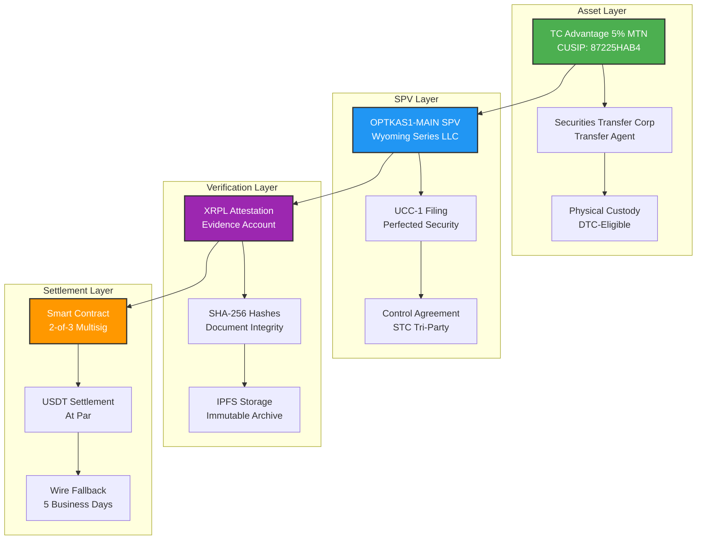
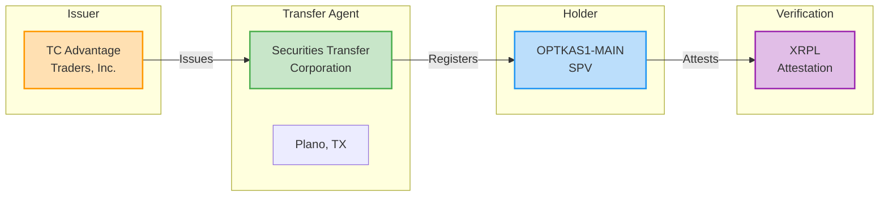
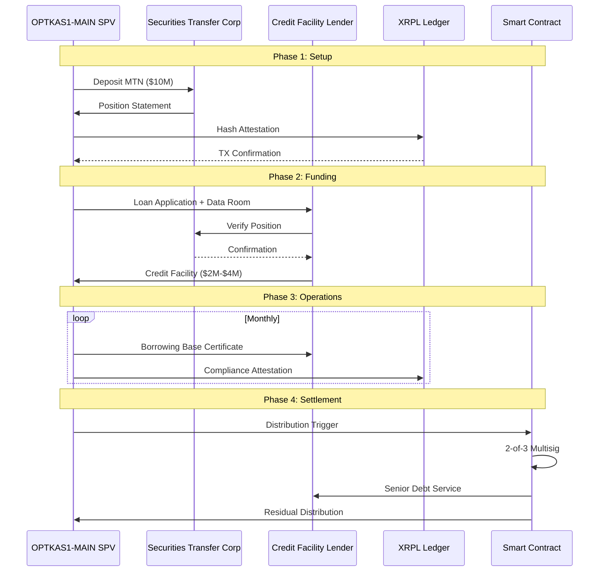
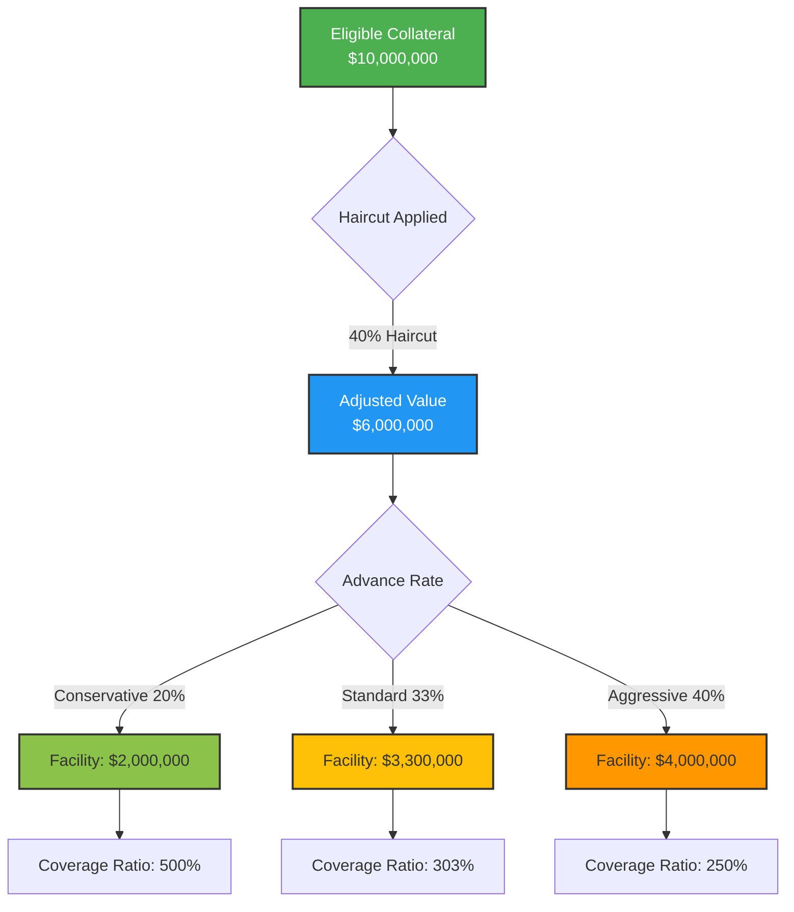
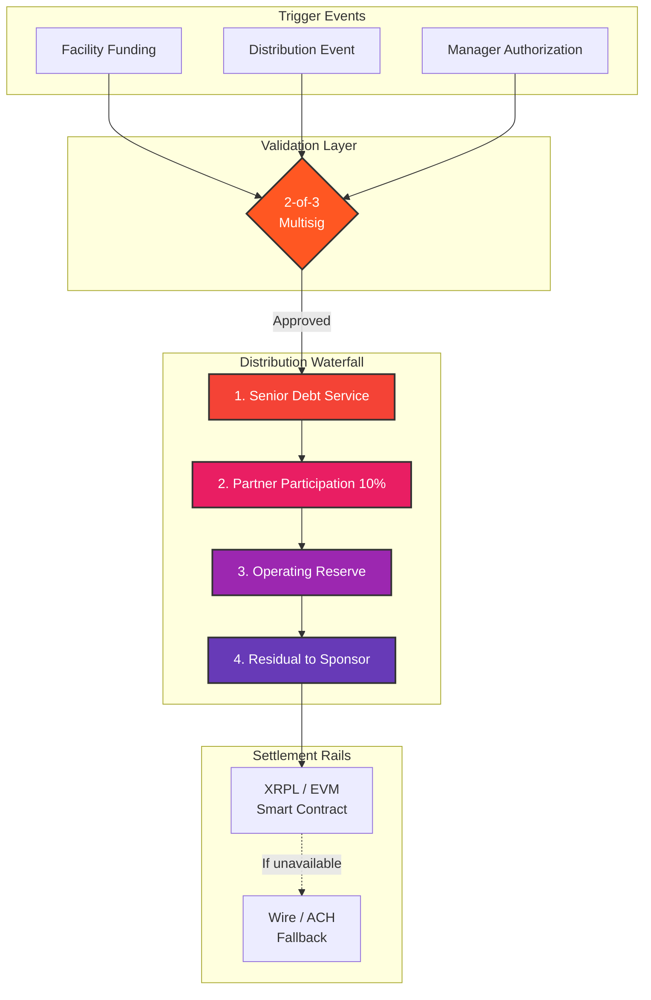
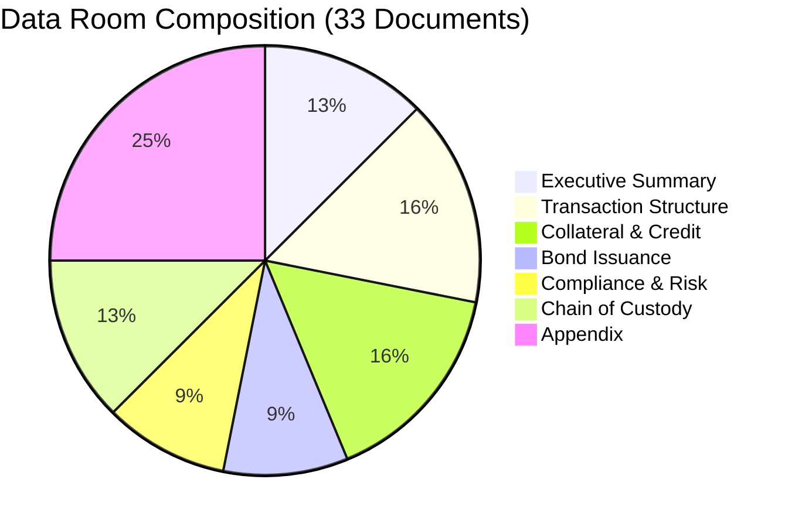
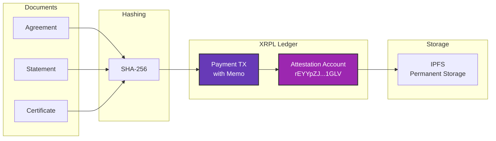
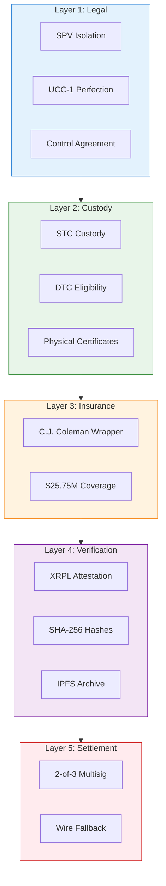
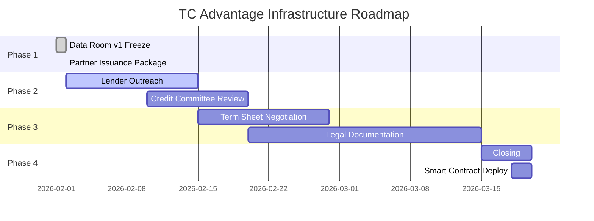

# TC Advantage RWA Infrastructure

[](https://github.com/unykornai/TC)
[](LICENSE)
[](CHANGELOG.md)
[](https://xrpl.org)
[](#asset-details)

> **Enterprise-grade Real World Asset (RWA) infrastructure for institutional bond-backed credit facilities**

---

## 📋 Table of Contents

- [Overview](#-overview)
- [System Architecture](#-system-architecture)
- [Asset Details](#-asset-details)
- [Transaction Flow](#-transaction-flow)
- [Smart Contract Settlement](#-smart-contract-settlement)
- [Data Room Structure](#-data-room-structure)
- [Verification Layer](#-verification-layer)
- [Security Model](#-security-model)
- [Quick Start](#-quick-start)
- [API Reference](#-api-reference)
- [Contributing](#-contributing)

---

## 🎯 Overview

This repository contains the complete infrastructure for the **TC Advantage Secured Notes** collateralized credit facility. It implements:

| Component | Description | Status |
|:----------|:------------|:------:|
| 🏛️ **SPV Structure** | Wyoming Series LLC bankruptcy-remote vehicle | ✅ Established |
| 📊 **Borrowing Base** | 40% haircut methodology with 250%+ coverage | ✅ Defined |
| ⛓️ **XRPL Attestation** | Immutable chain-of-custody verification | ✅ Specified |
| 🔐 **Smart Contracts** | 2-of-3 multisig automated settlement | ✅ Architected |
| 📁 **Data Room** | Institutional-grade document repository | ✅ Version-locked |

### Key Metrics

**All parameters are illustrative and subject to final documentation and counterparty approval.**

```
┌─────────────────────────────────────────────────────────────────────┐
│           ILLUSTRATIVE FACILITY PARAMETERS                          │
│              (For Structural Reference)                             │
├─────────────────────────────────────────────────────────────────────┤
│                                                                     │
│   COLLATERAL VALUE          ADVANCE RATE         FACILITY SIZE     │
│   ═══════════════          ════════════         ══════════════     │
│     $10,000,000               20-40%             $2M - $4M         │
│                                                                     │
│   COVERAGE RATIO            HAIRCUT              COUPON            │
│   ══════════════           ═════════            ════════           │
│       250%+                   40%                 5.00%            │
│                                                                     │
│   MATURITY                  INSURANCE            TRANSFER AGENT    │
│   ════════                 ═══════════          ════════════════   │
│   May 31, 2030             $25.75M              STC (Plano, TX)    │
│                                                                     │
└─────────────────────────────────────────────────────────────────────┘
```

---

## 🏗️ System Architecture

### High-Level Architecture



### Component Interaction Matrix

```
┌──────────────────────────────────────────────────────────────────────────┐
│                     COMPONENT INTERACTION MATRIX                          │
├──────────────────────────────────────────────────────────────────────────┤
│                                                                          │
│   ┌─────────────┐      ┌─────────────┐      ┌─────────────┐             │
│   │   ISSUER    │ ──── │   CUSTODY   │ ──── │     SPV     │             │
│   │ TC Advantage│      │     STC     │      │  OPTKAS1    │             │
│   └─────────────┘      └─────────────┘      └─────────────┘             │
│          │                    │                    │                     │
│          │                    │                    │                     │
│          ▼                    ▼                    ▼                     │
│   ┌─────────────┐      ┌─────────────┐      ┌─────────────┐             │
│   │  INSURANCE  │      │   CONTROL   │      │  UCC-1      │             │
│   │ CJ Coleman  │      │  AGREEMENT  │      │  FILING     │             │
│   └─────────────┘      └─────────────┘      └─────────────┘             │
│          │                    │                    │                     │
│          └────────────────────┼────────────────────┘                     │
│                               │                                          │
│                               ▼                                          │
│                    ┌─────────────────────┐                               │
│                    │   XRPL ATTESTATION  │                               │
│                    │   Evidence Layer    │                               │
│                    └─────────────────────┘                               │
│                               │                                          │
│               ┌───────────────┼───────────────┐                          │
│               ▼               ▼               ▼                          │
│        ┌───────────┐   ┌───────────┐   ┌───────────┐                     │
│        │  SHA-256  │   │   IPFS    │   │  SMART    │                     │
│        │  HASHES   │   │  STORAGE  │   │ CONTRACT  │                     │
│        └───────────┘   └───────────┘   └───────────┘                     │
│                                                                          │
└──────────────────────────────────────────────────────────────────────────┘
```

---

## 💎 Asset Details

### TC Advantage 5% Secured Medium Term Notes

| Attribute | Value |
|:----------|:------|
| **Issuer** | TC Advantage Traders, Ltd. (Bahamas) |
| **Security Type** | Secured Medium Term Notes |
| **CUSIP / ISIN** | Disclosed in Annex A (Institutional Data Room) |
| **Face Value** | $10,000,000.00 |
| **Coupon Rate** | 5.00% per annum |
| **Payment Frequency** | Semi-annual |
| **Maturity Date** | May 31, 2030 |
| **Day Count** | 30/360 |

### Custody Chain



### Custody Verification Flow

```
                         CUSTODY VERIFICATION FLOW
    ═══════════════════════════════════════════════════════════════
    
    ┌─────────────┐                              ┌─────────────────┐
    │   ISSUER    │                              │   VERIFICATION  │
    │ TC Advantage│ ─────────────────────────────│      LAYER      │
    └──────┬──────┘                              └────────┬────────┘
           │                                              │
           │ Issues Bond                                  │
           │ CUSIP: 87225HAB4                            │
           ▼                                              │
    ┌─────────────┐                                       │
    │  TRANSFER   │                                       │
    │   AGENT     │◄──────────────────────────────────────┤
    │    STC      │  Confirms Position                    │
    └──────┬──────┘                                       │
           │                                              │
           │ Registers Holder                             │
           │ Updates Records                              │
           ▼                                              │
    ┌─────────────┐                                       │
    │    SPV      │                                       │
    │ OPTKAS1-MAIN│──────────────────────────────────────►│
    └──────┬──────┘  Submits Attestation                  │
           │                                              │
           │ Files UCC-1                                  │
           │ Executes Control Agreement                   │
           ▼                                              │
    ┌─────────────┐         ┌──────────────┐      ┌──────┴──────┐
    │   LENDER    │◄────────│  DATA ROOM   │◄─────│    XRPL     │
    │   REVIEW    │         │   FROZEN     │      │  ATTESTATION │
    └─────────────┘         └──────────────┘      └─────────────┘
```

### Insurance Coverage

| Provider | Coverage | Period | Policy Type |
|:---------|:---------|:-------|:------------|
| **C.J. Coleman & Company** | $25,750,000 | 2024-2029 | Enhancement Wrapper |
| Location | London, UK | | Lloyd's Syndicate |

---

## 🔄 Transaction Flow

### Credit Facility Lifecycle



### Borrowing Base Calculation



### Borrowing Base Detail

```
                     BORROWING BASE CALCULATION ENGINE
    ════════════════════════════════════════════════════════════════
    
                         ┌────────────────────┐
                         │  ELIGIBLE ASSETS   │
                         │    $10,000,000     │
                         │  ─────────────────  │
                         │  TC Advantage MTN  │
                         │  CUSIP: 87225HAB4  │
                         └─────────┬──────────┘
                                   │
                         ┌─────────▼──────────┐
                         │    HAIRCUT (40%)   │
                         │   ───────────────   │
                         │  Market Risk: 20%  │
                         │  Liquidity: 10%    │
                         │  Concentration: 10% │
                         └─────────┬──────────┘
                                   │
                         ┌─────────▼──────────┐
                         │  ADJUSTED VALUE    │
                         │    $6,000,000      │
                         └─────────┬──────────┘
                                   │
              ┌────────────────────┼────────────────────┐
              │                    │                    │
              ▼                    ▼                    ▼
    ┌──────────────────┐ ┌──────────────────┐ ┌──────────────────┐
    │   CONSERVATIVE   │ │    STANDARD      │ │   AGGRESSIVE     │
    │  ──────────────  │ │  ──────────────  │ │  ──────────────  │
    │  Advance: 20%    │ │  Advance: 33%    │ │  Advance: 40%    │
    │  Facility: $2M   │ │  Facility: $3.3M │ │  Facility: $4M   │
    │  Coverage: 500%  │ │  Coverage: 303%  │ │  Coverage: 250%  │
    │  ▓▓▓▓▓▓▓▓▓▓░░░░░ │ │  ▓▓▓▓▓▓▓▓░░░░░░░ │ │  ▓▓▓▓▓▓░░░░░░░░░ │
    └──────────────────┘ └──────────────────┘ └──────────────────┘
```

---

## ⚡ Smart Contract Settlement

### Settlement Architecture



### Distribution Waterfall Detail

```
                        DISTRIBUTION WATERFALL
    ════════════════════════════════════════════════════════════════
    
    GROSS DISTRIBUTION                         
    ════════════════                           
         │                                     
         ▼                                     
    ┌─────────────────────────────────────────────────────────────┐
    │  ░░░░░░░░░░░░░░░░░░░░░░░░░░░░░░░░░░░░░░░░░░░░░░░░░░░░░░░░░░ │
    │  ░░░░░░░░░░░░░░░░░░░░░░░░░░░░░░░░░░░░░░░░░░░░░░░░░░░░░░░░░░ │
    │  ░░░░░░░░░░░░░░░░░░  GROSS INFLOW  ░░░░░░░░░░░░░░░░░░░░░░░░ │
    │  ░░░░░░░░░░░░░░░░░░░░░░░░░░░░░░░░░░░░░░░░░░░░░░░░░░░░░░░░░░ │
    └─────────────────────────────────────────────────────────────┘
         │                                     
         ▼                                     
    ┌─────────────────────────────────────────────────────────────┐
    │  ▓▓▓▓▓▓▓▓▓▓▓▓▓▓▓▓▓▓▓▓▓▓▓▓▓▓▓▓▓▓▓▓▓▓▓▓▓▓▓▓▓▓▓▓▓▓▓▓▓▓▓▓▓▓▓▓▓ │
    │  ▓▓▓▓▓▓▓▓▓▓▓▓▓▓▓▓▓  1. SENIOR DEBT SERVICE  ▓▓▓▓▓▓▓▓▓▓▓▓▓▓ │
    │  ▓▓▓▓▓▓▓▓▓▓▓▓▓▓▓▓▓▓▓  (Principal + Interest)  ▓▓▓▓▓▓▓▓▓▓▓▓ │
    │  ▓▓▓▓▓▓▓▓▓▓▓▓▓▓▓▓▓▓▓▓▓▓▓▓▓▓▓▓▓▓▓▓▓▓▓▓▓▓▓▓▓▓▓▓▓▓▓▓▓▓▓▓▓▓▓▓▓ │
    └─────────────────────────────────────────────────────────────┘
         │                                     
         ▼                                     
    ┌─────────────────────────────────────────────────────────────┐
    │  ████████████  2. PARTNER PARTICIPATION (10%)  ████████████ │
    │  ████████████████  Unykorn 7777, Inc.  ████████████████████ │
    └─────────────────────────────────────────────────────────────┘
         │                                     
         ▼                                     
    ┌─────────────────────────────────────────────────────────────┐
    │  ▒▒▒▒▒▒▒▒▒▒  3. OPERATING RESERVE  ▒▒▒▒▒▒▒▒▒▒▒▒▒▒▒▒▒▒▒▒▒▒ │
    │  ▒▒▒▒▒▒▒▒▒▒▒▒▒▒  (Maintenance Buffer)  ▒▒▒▒▒▒▒▒▒▒▒▒▒▒▒▒▒▒ │
    └─────────────────────────────────────────────────────────────┘
         │                                     
         ▼                                     
    ┌─────────────────────────────────────────────────────────────┐
    │  ░░░░░░░░░░░░░░░░  4. RESIDUAL TO SPONSOR  ░░░░░░░░░░░░░░░░ │
    │  ░░░░░░░░░░░░░░░░░░░░  (Net Profit)  ░░░░░░░░░░░░░░░░░░░░░░ │
    └─────────────────────────────────────────────────────────────┘
```

### Multisig Configuration

```json
{
  "threshold": "2-of-3",
  "signers": [
    { "role": "Infrastructure Partner", "entity": "Unykorn 7777, Inc." },
    { "role": "SPV Manager", "entity": "OPTKAS1-MAIN SPV" },
    { "role": "Neutral Escrow", "entity": "TBD" }
  ],
  "payment_address": "Designated per executed agreement",
  "networks": ["XRPL", "EVM-compatible"]
}
```

### Payment Rails

```
                    ┌─────────────────────────────────────┐
                    │         SMART CONTRACT               │
                    │         SETTLEMENT                   │
                    └─────────────────────────────────────┘
                                    │
                    ┌───────────────┴───────────────┐
                    ▼                               ▼
        ┌───────────────────┐           ┌───────────────────┐
        │   PRIMARY RAIL    │           │   FALLBACK RAIL   │
        │   ─────────────   │           │   ─────────────   │
        │                   │           │                   │
        │   XRPL / EVM      │           │   Wire / ACH      │
        │   USDT at Par     │           │   USD Direct      │
        │   ~4 sec finality │           │   5 business days │
        │                   │           │                   │
        │   ████████████    │           │   ░░░░░░░░░░░░    │
        │   PREFERRED       │           │   BACKUP          │
        └───────────────────┘           └───────────────────┘
                    │                               │
                    └───────────────┬───────────────┘
                                    ▼
                    ┌─────────────────────────────────────┐
                    │   RECIPIENT ADDRESS                  │
                    │   Designated per executed agreement  │
                    │   ─────────────────────────────────  │
                    │   Specified in PARTNER_ISSUANCE_v1   │
                    └─────────────────────────────────────┘
```

---

## 📁 Data Room Structure

### Repository Layout

```
TC/
├── 📂 DATA_ROOM_v1/                    # Frozen institutional data room
│   ├── 📂 00_EXEC_SUMMARY/             # Executive overviews
│   │   ├── EXECUTIVE_SUMMARY.md
│   │   ├── INVESTOR-PITCH-DECK.md
│   │   └── README.md
│   │
│   ├── 📂 01_TRANSACTION_STRUCTURE/    # Deal documents
│   │   ├── LOAN_COMMITMENT_PACKAGE-v2.md
│   │   ├── ANNEX_A_Tranche_Details.md
│   │   └── ANNEX_B_System_Architecture.md
│   │
│   ├── 📂 02_COLLATERAL_AND_CREDIT/    # Collateral documentation
│   │   ├── STC_Statement.pdf
│   │   ├── BORROWING_BASE_POLICY.md
│   │   └── LENDER-PACKET.md
│   │
│   ├── 📂 03_BOND_AND_NOTE_ISSUANCE/   # Bond specifications
│   │   └── optkas1-bond-issuance-guide.md
│   │
│   ├── 📂 04_COMPLIANCE_AND_RISK/      # Regulatory compliance
│   │   ├── KYC-AML-COMPLIANCE-PACKAGE.md
│   │   └── INSURANCE-UNDERWRITING-PACKAGE.md
│   │
│   ├── 📂 05_CHAIN_OF_CUSTODY/         # Verification artifacts
│   │   ├── XRPL_ATTESTATION_SPEC.md
│   │   └── AUDIT_RUNBOOK.md
│   │
│   ├── 📂 99_APPENDIX/                 # Templates and appendices
│   │
│   ├── HASHES.txt                      # SHA-256 integrity proofs
│   ├── INDEX.md                        # Navigation guide
│   └── data-room.json                  # Machine-readable manifest
│
├── 📂 PARTNER_ISSUANCE_v1/             # Partner agreement package
│   ├── 📂 00_README/
│   │   ├── README.md
│   │   └── ISSUANCE_CHECKLIST.md
│   │
│   ├── 📂 01_AGREEMENT/
│   │   ├── STRATEGIC_INFRASTRUCTURE_EXECUTION_AGREEMENT.md
│   │   ├── EXHIBIT_A_ECONOMIC_PARTICIPATION.md
│   │   ├── EXHIBIT_B_SMART_CONTRACT_SETTLEMENT_SPEC.md
│   │   └── SIGNATURE_PAGE.md
│   │
│   ├── 📂 02_DISCLOSURES/
│   │   ├── ROLE_DISCLOSURE_NON_FIDUCIARY.md
│   │   ├── RISK_DISCLOSURE_TECH_AND_SETTLEMENT.md
│   │   └── CONFIDENTIALITY_NOTICE.md
│   │
│   ├── 📂 03_CRYPTO_PROOFS/
│   │   ├── HASHES.txt
│   │   ├── manifest.json
│   │   ├── MULTISIG_CONFIG.json
│   │   └── SIGNING_INSTRUCTIONS.md
│   │
│   └── 📂 99_APPENDIX/
│       ├── PARTNERSHIP_OVERVIEW_ONEPAGER.md
│       └── DATA_ROOM_v1_POINTERS.md
│
├── 📂 bond-smart-contracts/            # Smart contract source
│
└── README.md                           # This file
```

### Document Classification



### Reading Order by Role

```
                         READING ORDER BY ROLE
    ════════════════════════════════════════════════════════════════
    
    ┌─────────────────────────────────────────────────────────────┐
    │                    CREDIT COMMITTEE                          │
    │  ───────────────────────────────────────────────────────    │
    │  1. EXECUTIVE_SUMMARY.md                                     │
    │  2. LOAN_COMMITMENT_PACKAGE-v2.md                            │
    │  3. STC_Statement.pdf                                        │
    │  4. BORROWING_BASE_POLICY.md                                 │
    │  5. ANNEX_A_Tranche_Details.md                               │
    │  ───────────────────────────────────────────────────────    │
    │  Est. Review Time: 45 minutes                                │
    └─────────────────────────────────────────────────────────────┘
    
    ┌─────────────────────────────────────────────────────────────┐
    │                    LEGAL COUNSEL                             │
    │  ───────────────────────────────────────────────────────    │
    │  1. STRATEGIC_INFRASTRUCTURE_EXECUTION_AGREEMENT.md          │
    │  2. EXHIBIT_A_ECONOMIC_PARTICIPATION.md                      │
    │  3. EXHIBIT_B_SMART_CONTRACT_SETTLEMENT_SPEC.md              │
    │  4. KYC-AML-COMPLIANCE-PACKAGE.md                            │
    │  5. LEGAL_OPINION_TEMPLATE.md                                │
    │  ───────────────────────────────────────────────────────    │
    │  Est. Review Time: 90 minutes                                │
    └─────────────────────────────────────────────────────────────┘
    
    ┌─────────────────────────────────────────────────────────────┐
    │                    OPERATIONS / AUDIT                        │
    │  ───────────────────────────────────────────────────────    │
    │  1. AUDIT_RUNBOOK.md                                         │
    │  2. XRPL_ATTESTATION_SPEC.md                                 │
    │  3. ANNEX_B_System_Architecture.md                           │
    │  4. HASHES.txt                                               │
    │  5. data-room.json                                           │
    │  ───────────────────────────────────────────────────────    │
    │  Est. Review Time: 60 minutes                                │
    └─────────────────────────────────────────────────────────────┘
```

---

## 🔐 Verification Layer

### XRPL Attestation System



### Attestation Flow Detail

```
                        XRPL ATTESTATION FLOW
    ════════════════════════════════════════════════════════════════
    
    STEP 1: DOCUMENT PREPARATION
    ────────────────────────────
    
    ┌──────────────┐   ┌──────────────┐   ┌──────────────┐
    │  Document A  │   │  Document B  │   │  Document C  │
    │  ──────────  │   │  ──────────  │   │  ──────────  │
    │  Agreement   │   │  Statement   │   │  Certificate │
    └──────┬───────┘   └──────┬───────┘   └──────┬───────┘
           │                  │                  │
           └──────────────────┼──────────────────┘
                              │
                              ▼
    STEP 2: HASH GENERATION
    ────────────────────────
    
                    ┌─────────────────┐
                    │    SHA-256      │
                    │  ───────────    │
                    │  Algorithm      │
                    └────────┬────────┘
                             │
                             ▼
                    ┌─────────────────────────────────────┐
                    │  HASH: A3B7C9...F2E1                 │
                    │  (64 character hex string)          │
                    └────────┬────────────────────────────┘
                             │
                             ▼
    STEP 3: XRPL SUBMISSION
    ────────────────────────
    
                    ┌─────────────────────────────────────┐
                    │         XRPL PAYMENT TX              │
                    │  ───────────────────────────────    │
                    │  From: rEYYpZJ...1GLV               │
                    │  To:   rEYYpZJ...1GLV  (self)       │
                    │  Amount: 1 drop                     │
                    │  Memo: [SHA-256 hash]               │
                    └────────┬────────────────────────────┘
                             │
                             ▼
                    ┌─────────────────────────────────────┐
                    │         LEDGER CONFIRMATION          │
                    │  ───────────────────────────────    │
                    │  TX Hash: 8F7A2B...                  │
                    │  Ledger: 12345678                    │
                    │  Timestamp: 2026-02-02T19:30:00Z     │
                    └─────────────────────────────────────┘
    
    STEP 4: VERIFICATION
    ────────────────────
    
    Anyone can verify by:
    ┌─────────────────────────────────────────────────────────────┐
    │  1. Retrieve TX from XRPL Explorer                          │
    │  2. Extract memo (hash)                                     │
    │  3. Compute SHA-256 of local document                       │
    │  4. Compare hashes                                          │
    │  5. MATCH = Document unchanged since attestation            │
    └─────────────────────────────────────────────────────────────┘
```

### Attestation Account

| Parameter | Value |
|:----------|:------|
| **Network** | XRP Ledger Mainnet |
| **Account** | `rEYYpZJ7KNqj5dqHExM9VCQWNG6j7j1GLV` |
| **Purpose** | Evidence-only (no custody) |
| **Explorer** | [View on XRPL](https://livenet.xrpl.org/accounts/rEYYpZJ7KNqj5dqHExM9VCQWNG6j7j1GLV) |

**Note:** XRPL attestations are performed post-execution and post-freeze of final documents.

---

## 🛡️ Security Model

### Defense in Depth



### Security Stack Visualization

```
                         SECURITY STACK
    ════════════════════════════════════════════════════════════════
    
    ┌─────────────────────────────────────────────────────────────┐
    │  LAYER 5: SETTLEMENT SECURITY                                │
    │  ▓▓▓▓▓▓▓▓▓▓▓▓▓▓▓▓▓▓▓▓▓▓▓▓▓▓▓▓▓▓▓▓▓▓▓▓▓▓▓▓▓▓▓▓▓▓▓▓▓▓▓▓▓▓▓▓ │
    │  • 2-of-3 Multisig Authorization                             │
    │  • Wire Transfer Fallback (5 days)                           │
    │  • Emergency Pause Capability                                │
    └─────────────────────────────────────────────────────────────┘
                                ▲
    ┌───────────────────────────┴─────────────────────────────────┐
    │  LAYER 4: VERIFICATION LAYER                                 │
    │  ████████████████████████████████████████████████████████████│
    │  • XRPL Attestation (Immutable)                              │
    │  • SHA-256 Hash Proofs                                       │
    │  • IPFS Permanent Storage                                    │
    └─────────────────────────────────────────────────────────────┘
                                ▲
    ┌───────────────────────────┴─────────────────────────────────┐
    │  LAYER 3: INSURANCE COVERAGE                                 │
    │  ▒▒▒▒▒▒▒▒▒▒▒▒▒▒▒▒▒▒▒▒▒▒▒▒▒▒▒▒▒▒▒▒▒▒▒▒▒▒▒▒▒▒▒▒▒▒▒▒▒▒▒▒▒▒▒▒ │
    │  • C.J. Coleman & Co. Wrapper                                │
    │  • $25.75M Coverage (2024-2029)                              │
    │  • Lloyd's Syndicate Backing                                 │
    └─────────────────────────────────────────────────────────────┘
                                ▲
    ┌───────────────────────────┴─────────────────────────────────┐
    │  LAYER 2: CUSTODY LAYER                                      │
    │  ░░░░░░░░░░░░░░░░░░░░░░░░░░░░░░░░░░░░░░░░░░░░░░░░░░░░░░░░░░ │
    │  • Securities Transfer Corp (Regulated)                      │
    │  • DTC Eligible Securities                                   │
    │  • Physical + Book-Entry Custody                             │
    └─────────────────────────────────────────────────────────────┘
                                ▲
    ┌───────────────────────────┴─────────────────────────────────┐
    │  LAYER 1: LEGAL STRUCTURE                                    │
    │  ▓▓▓▓▓▓▓▓▓▓▓▓▓▓▓▓▓▓▓▓▓▓▓▓▓▓▓▓▓▓▓▓▓▓▓▓▓▓▓▓▓▓▓▓▓▓▓▓▓▓▓▓▓▓▓▓ │
    │  • Wyoming Series LLC (Bankruptcy Remote)                    │
    │  • UCC-1 Perfected Security Interest                         │
    │  • Tri-Party Control Agreement                               │
    └─────────────────────────────────────────────────────────────┘
```

### Access Control Matrix

| Role | Data Room | Agreements | Smart Contract | XRPL Keys |
|:-----|:---------:|:----------:|:--------------:|:---------:|
| SPV Manager | ✅ Full | ✅ Sign | ✅ 1-of-3 | ✅ Attest |
| Lender | 📖 Read | 📖 Review | ❌ None | ❌ None |
| Counsel | 📖 Read | ✅ Draft | ❌ None | ❌ None |
| Auditor | 📖 Read | 📖 Read | 📖 Verify | 📖 Verify |
| Partner | 📖 Select | ✅ Sign | ✅ 1-of-3 | ❌ None |

---

## 🚀 Quick Start

### Prerequisites

- Git
- PowerShell 5.1+ (Windows) or Bash (Linux/macOS)
- IPFS CLI (optional, for pinning)
- Node.js 18+ (for smart contract development)

### Clone Repository

```bash
git clone https://github.com/unykornai/TC.git
cd TC
```

### Verify Data Room Integrity

```powershell
# PowerShell
Get-ChildItem -Path "DATA_ROOM_v1" -Recurse -File |
  Where-Object { $_.Name -notin @("HASHES.txt","data-room.json","INDEX.md") } |
  ForEach-Object {
    $hash = (Get-FileHash $_.FullName -Algorithm SHA256).Hash
    $rel = $_.FullName.Replace("$PWD\DATA_ROOM_v1\","")
    "$hash  $rel"
  }
```

```bash
# Bash
find DATA_ROOM_v1 -type f ! -name "HASHES.txt" ! -name "data-room.json" ! -name "INDEX.md" \
  -exec shasum -a 256 {} \;
```

### Pin to IPFS

```bash
ipfs add -r DATA_ROOM_v1
# Returns CID for permanent storage
```

### Issue Partner Documents for Signing

To issue the Strategic Infrastructure & Execution Agreement to partners:

**Automated (Recommended):**
```powershell
# Complete issuance process
.\issue-partner-documents.ps1 -All

# Or use the batch file on Windows
.\issue-partner-documents.bat
```

**What this does:**
- ✅ Validates package integrity
- ✅ Generates SHA-256 hashes for verification
- ✅ Creates email templates for both parties
- ✅ Prepares IPFS-ready package
- ✅ Generates issuance summary

**For detailed instructions:** See [HOW_TO_ISSUE_PARTNER_DOCS.md](HOW_TO_ISSUE_PARTNER_DOCS.md)

**Documents issued:**
- Partner Issuance Package: [PARTNER_ISSUANCE_v1/](PARTNER_ISSUANCE_v1/)
- Agreement Send Package: [Agreement_Send_Package/](Agreement_Send_Package/)

---

## 📚 API Reference

### XRPL Attestation API

```javascript
// Submit attestation to XRPL
const xrpl = require("xrpl");

async function submitAttestation(hash) {
  const client = new xrpl.Client("wss://xrplcluster.com");
  await client.connect();
  
  const attestation = {
    TransactionType: "Payment",
    Account: "rEYYpZJ7KNqj5dqHExM9VCQWNG6j7j1GLV",
    Destination: "rEYYpZJ7KNqj5dqHExM9VCQWNG6j7j1GLV",
    Amount: "1",
    Memos: [{
      Memo: {
        MemoType: Buffer.from("attestation").toString("hex"),
        MemoData: Buffer.from(hash).toString("hex")
      }
    }]
  };
  
  // Sign and submit...
  await client.disconnect();
}
```

### Smart Contract Interface

```solidity
// SPDX-License-Identifier: MIT
pragma solidity ^0.8.19;

interface ISettlementContract {
    
    /// @notice Distribute funds according to waterfall
    /// @param grossAmount Total amount to distribute
    function distributeParticipation(uint256 grossAmount) external;
    
    /// @notice Check if operation is approved by multisig
    /// @return bool True if 2-of-3 signers approved
    function isMultisigApproved() external view returns (bool);
    
    /// @notice Emergency pause distributions
    function pause() external;
    
    /// @notice Resume distributions after pause
    function unpause() external;
    
    /// @notice Emitted on each distribution
    event DistributionEvent(
        uint256 indexed timestamp,
        uint256 grossAmount,
        uint256 partnerShare,
        bytes32 txHash
    );
}
```

---

## 📊 Status Dashboard

| Component | Status | Last Updated | Notes |
|:----------|:------:|:------------:|:------|
| DATA_ROOM_v1 | 🟢 Frozen | 2026-02-02 | 33 documents, 7 categories |
| PARTNER_ISSUANCE_v1 | 🟢 Ready | 2026-02-02 | 15 documents |
| XRPL Attestation | 🟢 Specified | 2026-02-02 | Account established |
| Smart Contracts | 🟡 Architected | 2026-02-02 | Awaiting deployment |
| Lender Outreach | 🟡 Preparation Phase | 2026-02-02 | Documentation complete |

---

## 📈 Roadmap



---

## 🤝 Contributing

This is a private institutional repository. Contributions are by invitation only.

### For Authorized Contributors

1. Fork the repository
2. Create feature branch (`git checkout -b feature/enhancement`)
3. Commit changes (`git commit -m 'Add enhancement'`)
4. Push to branch (`git push origin feature/enhancement`)
5. Open Pull Request

---

## 📞 Contact

| Role | Contact |
|:-----|:--------|
| **SPV Manager** | jimmy@optkas.com |
| **Technical Lead** | [Unykorn 7777](https://github.com/unykornai) |

---

## 📄 License

Copyright © 2026 OPTKAS1-MAIN SPV & Unykorn 7777, Inc. All rights reserved.

This repository contains proprietary and confidential information. Unauthorized access, use, or distribution is prohibited.

---

<div align="center">

**Built with 🔧 by [Unykorn 7777](https://github.com/unykornai)**

*RWA Infrastructure • Blockchain Verification • Institutional-Grade Documentation*

[](https://xrpl.org)
[](https://ipfs.io)
[](#)

</div>
