# 🏛️ OPTKAS — Sovereign Financial Platform

<div align="center">


**Multi-Ledger Bond Infrastructure · Institutional-Grade · Fully Auditable · Multisig Governed**

*Built by [Unykorn 7777, Inc.](https://github.com/unykornai) for OPTKAS1-MAIN SPV (Wyoming, USA)*

---


</div>

---

## 📑 Table of Contents

> Color Legend:
> 🔴 **Critical / Security** · 🟠 **Infrastructure** · 🟡 **Configuration** · 🟢 **Operations** · 🔵 **Development** · 🟣 **Architecture**

| # | Section | Category | Description |
|---|---|---|---|
| 1 | [🟣 System Overview](#-system-overview) | Architecture | Platform identity, mission, and capabilities |
| 2 | [🟣 Architecture Layers](#-architecture-layers) | Architecture | 5-layer sovereign infrastructure model |
| 3 | [🟠 Infrastructure Map](#-infrastructure-map) | Infrastructure | Complete package tree, apps, scripts |
| 4 | [🔵 Multi-Ledger Network](#-multi-ledger-network) | Development | XRPL + Stellar network config and accounts |
| 5 | [🟡 Token Registry](#-token-registry) | Configuration | All issued tokens and their properties |
| 6 | [🔴 Governance & Multisig](#-governance--multisig) | Security | Signer roles, thresholds, emergency controls |
| 7 | [🟢 Operational Flows](#-operational-flows) | Operations | Bond lifecycle, escrow, settlement, trading |
| 8 | [🟣 Data Flow Architecture](#-data-flow-architecture) | Architecture | Transaction pipeline, attestation chain, audit trail |
| 9 | [🔴 Compliance & Audit](#-compliance--audit) | Security | KYC/AML, 7-year retention, dual-ledger hash anchoring |
| 10 | [🟠 Bridge Infrastructure](#-bridge-infrastructure) | Infrastructure | XRPL XChain sidechain bridge system |
| 11 | [🟢 AI Execution Systems](#-ai-execution-systems) | Operations | 4 AI agent systems with HITL controls |
| 12 | [🟢 CLI & Dashboard](#-cli--dashboard) | Operations | Unified CLI and institutional dashboard |
| 13 | [🟣 Institutional Funding Architecture](#-institutional-funding-architecture) | Architecture | $4M facility structure and lender pipeline |
| 14 | [🔵 Test Coverage](#-test-coverage) | Development | 27 suites, 367 tests, all green |
| 15 | [🟡 Quick Start](#-quick-start) | Configuration | Setup, install, run |

---

## 🟣 System Overview

```
╔══════════════════════════════════════════════════════════════════╗
║                OPTKAS SOVEREIGN FINANCIAL PLATFORM               ║
║                                                                  ║
║  Owner:    OPTKAS1-MAIN SPV (Wyoming, USA)                       ║
║  Builder:  Unykorn 7777, Inc.                                    ║
║  Version:  1.0.0 | Deployed: 2026-02-06                          ║
║  Ledgers:  XRPL (6 accounts) + Stellar (3 accounts)             ║
║  Tokens:   OPTKAS.BOND · OPTKAS.ESCROW · OPTKAS.ATTEST · USD    ║
║  Security: 2-of-3 multisig · never auto-signs · full audit      ║
║  Tests:    27 suites · 367 tests · 100% green                   ║
╚══════════════════════════════════════════════════════════════════╝
```

### What This System Does

OPTKAS is a **sovereign, multi-ledger bond funding infrastructure** that:

- 🏦 **Issues regulated claim receipts** on XRPL (IOUs backed by real-world assets)
- 💰 **Manages conditional escrow** with crypto-condition and time-based release
- 📜 **Anchors document hashes** on both XRPL and Stellar for dual-ledger attestation
- 🔐 **Enforces 2-of-3 multisig governance** — no single party controls funds
- 📊 **Runs algorithmic trading** with TWAP/VWAP/limit strategies and circuit breakers
- 🌉 **Bridges assets** between XRPL locking and issuing chains
- 🤖 **Deploys 4 AI execution systems** with human-in-the-loop at every critical step
- 📋 **Generates 8 types of audit reports** with 7-year retention and hash verification
- ⚖️ **Handles regulatory compliance** for US jurisdictions with freeze/clawback controls

---

## 🟣 Architecture Layers

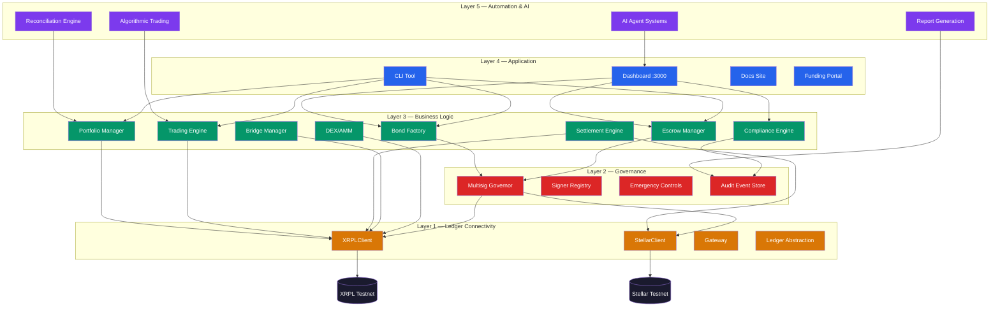

### Layer Color Legend

| Layer | Color | Purpose | Packages |
|---|---|---|---|
| **Layer 5** | 🟣 Purple | Automation, AI, Reporting | `agents`, `trading`, `reporting`, `reconciliation` |
| **Layer 4** | 🔵 Blue | User-facing Applications | `dashboard`, `cli`, `docs-site`, `funding-portal` |
| **Layer 3** | 🟢 Green | Business Logic & Domain | `bond`, `escrow`, `compliance`, `portfolio`, `trading`, `settlement`, `bridge`, `dex-amm` |
| **Layer 2** | 🔴 Red | Governance & Security | `governance`, `audit`, `compliance` |
| **Layer 1** | 🟠 Orange | Ledger Connectivity | `xrpl-core`, `stellar-core`, `gateway`, `ledger` |

---

## 🟠 Infrastructure Map

### Complete Package Tree

```
OPTKAS1-Funding-System/
│
├── 📦 packages/                          # 20 Core Modules
│   ├── 🟠 xrpl-core/                    # XRPL WebSocket client, account queries, tx prep
│   ├── 🟠 stellar-core/                 # Stellar Horizon client, asset ops, SEP protocols
│   ├── 🟠 ledger/                       # Cross-ledger abstraction layer
│   ├── 🟠 gateway/                      # Fiat on/off-ramp gateway (SEP-24)
│   ├── 🔴 governance/                   # MultisigGovernor, signer registry, emergency controls
│   ├── 🔴 compliance/                   # KYC/AML, jurisdiction rules, freeze/clawback
│   ├── 🔴 audit/                        # AuditEventStore, ReportGenerator, hash anchoring
│   ├── 🟢 bond/                         # BondFactory, lifecycle management, waterfall
│   ├── 🟢 issuance/                     # IOU issuance engine, regulated asset creation
│   ├── 🟢 escrow/                       # EscrowManager, crypto-condition, time-based
│   ├── 🟢 attestation/                  # Document hash anchoring on XRPL + Stellar
│   ├── 🟢 settlement/                   # SettlementEngine, atomic cross-ledger settlement
│   ├── 🟢 portfolio/                    # PortfolioManager, NAV, P&L, exposure, IOU sync
│   ├── 🟢 rwa/                          # RWA tokenization, collateral management
│   ├── 🟢 bridge/                       # BridgeManager, XChain ops, witness config
│   ├── 🟢 dex/                          # DEX order management, pathfinding
│   ├── 🟢 dex-amm/                      # AMMManager, liquidity provision, pool creation
│   ├── 🟣 trading/                      # TradingEngine, TWAP/VWAP/limit, risk controls
│   ├── 🟣 agents/                       # AgentManager, strategy execution, dry-run
│   └── 🟣 reporting/                    # ReportingEngine, 8 report types
│
├── 🔵 apps/                              # 3 Applications
│   ├── dashboard/                        # Institutional dashboard (port 3000)
│   ├── cli/                              # Unified optkas CLI
│   └── docs-site/                        # Documentation site builder
│
├── 📜 scripts/                           # 30+ Operational Scripts
│   ├── lib/cli-utils.ts                  # Shared CLI utilities
│   ├── reconcile-ledgers.ts              # Cross-ledger reconciliation
│   ├── setup-trustlines.ts               # Trustline configuration
│   ├── provision-testnet.ts              # Testnet faucet funding
│   ├── verify-testnet.ts                 # Account verification
│   ├── generate-audit-report.ts          # 8 audit report types
│   ├── xrpl-*.ts                         # XRPL-specific operations (7 scripts)
│   ├── stellar-*.ts                      # Stellar-specific operations (4 scripts)
│   └── bond-*.ts                         # Bond lifecycle scripts (3 scripts)
│
├── ⚙️ config/
│   └── platform-config.yaml              # Master configuration (389 lines)
│
├── 🧪 tests/                             # 27 Test Suites
│   ├── phase3-infrastructure.test.ts
│   ├── phase4-capital-markets.test.ts
│   ├── phase5-infrastructure.test.ts
│   ├── phase6-e2e.test.ts
│   ├── phase7-connectivity.test.ts
│   └── phase8-operations.test.ts
│
├── 📄 docs/                              # 48 Documentation Files
│   ├── ARCHITECTURE.md
│   ├── GOVERNANCE.md
│   ├── COMPLIANCE_CONTROLS.md
│   ├── AUDIT_SPEC.md
│   ├── XRPL_SPEC.md
│   ├── STELLAR_SPEC.md
│   ├── RISK.md
│   ├── SECURITY.md
│   └── ... (40 more)
│
├── 📁 data_room/                         # Institutional Data Room
│   ├── 01_Entity/
│   ├── 02_Asset/
│   ├── 03_Facility/
│   ├── 04_Offering/
│   ├── 05_Compliance/
│   └── 06_Technical/
│
└── 📁 DATA_ROOM_v1/                      # Versioned Data Room
    ├── 00_EXEC_SUMMARY/
    ├── 01_TRANSACTION_STRUCTURE/
    ├── 02_COLLATERAL_AND_CREDIT/
    ├── 03_BOND_AND_NOTE_ISSUANCE/
    ├── 04_COMPLIANCE_AND_RISK/
    ├── 05_CHAIN_OF_CUSTODY/
    └── 99_APPENDIX/
```

### Package Dependency Graph

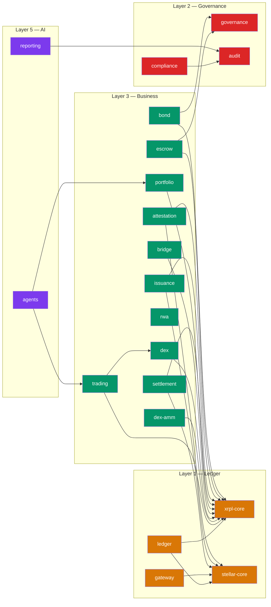

---

## 🔵 Multi-Ledger Network

### Network Topology

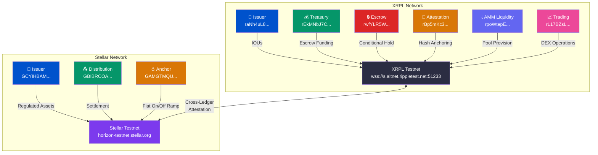

### XRPL Accounts

| Role | Address | Purpose | Settings |
|---|---|---|---|
| 🏦 **Issuer** | `raNh4uL8UxiEec2nXADxFX4fFgPMaNAUYk` | IOU issuance (bonds, escrow tokens, attestation markers) | `default_ripple: true` |
| 💰 **Treasury** | `rEkMNbJ7CgnK8JnmHW2nKUpc3d5ujDqLB4` | Operational treasury, escrow funding | `require_dest_tag: true` |
| 🔒 **Escrow** | `rwfYLR5W2BXat7zKT9mA94j9kJN6cYJNNs` | Conditional settlement escrow | — |
| 📜 **Attestation** | `rBp5mKc3iY7URVmf6tiqha7uJCM3V2oVfP` | Document hash anchoring (evidence only) | No value issuance |
| 💧 **AMM Liquidity** | `rpoWtepEhM4hye2KyC5UiLdBerBNgik4bR` | AMM liquidity provision | — |
| 📈 **Trading** | `rL17BZsLq7ejPiJiY28QwmrK8NWWG8987o` | Algorithmic trading and DEX | `require_dest_tag: true` |

### Stellar Accounts

| Role | Public Key | Purpose | Settings |
|---|---|---|---|
| 🏦 **Issuer** | `GCYIHBAM2ND4E3XRUWDLVKZCLEHLH63PPXE2ZNIUXDMAETEZMSPA6U3C` | Regulated asset issuance | `auth_required`, `auth_revocable`, `clawback_enabled` |
| 📤 **Distribution** | `GBIBRCOADUPB7BDJEGLS3ZXQ2MPMDGPIEZQZF37XA5LFVO4R35Y7RNSI` | Asset distribution and settlement | — |
| ⚓ **Anchor** | `GAMGTMQUC22RLDEVIG3ZLPKENHARCCBDXGLZTTIIWYOIIQNSNZJVPK4V` | Fiat on/off-ramp (SEP-24) | — |

---

## 🟡 Token Registry

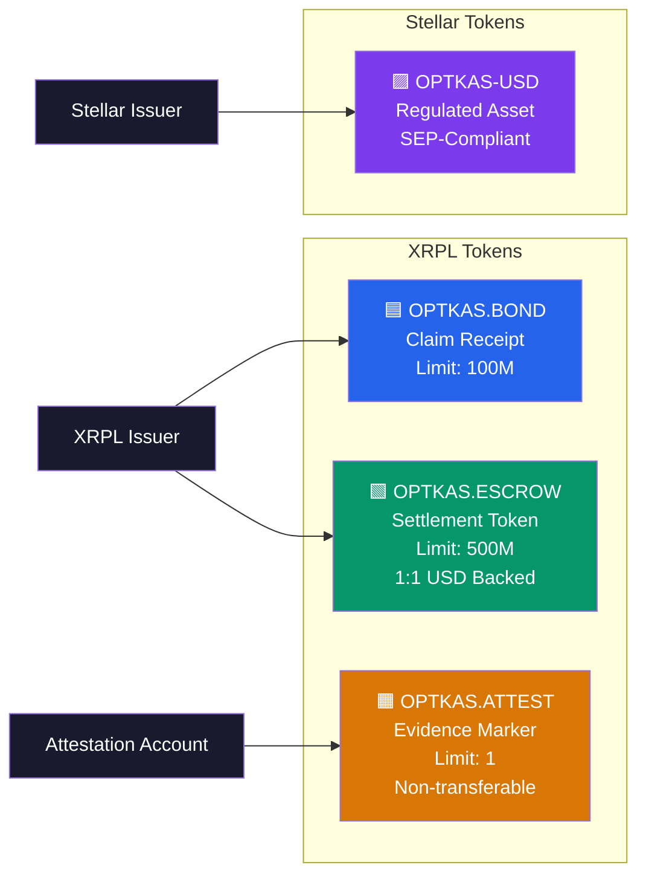

| Token | Ledger | Type | Issuer | Limit | Freeze | Transferable | Purpose |
|---|---|---|---|---|---|---|---|
| **OPTKAS.BOND** | XRPL | `claim_receipt` | Issuer | 100,000,000 | ✅ | ❌ | Claim receipt for bond participation |
| **OPTKAS.ESCROW** | XRPL | `settlement_token` | Issuer | 500,000,000 | ✅ | ❌ | Settlement coordination (1:1 USD) |
| **OPTKAS.ATTEST** | XRPL | `evidence_token` | Attestation | 1 | ❌ | ❌ | Non-transferable proof of document existence |
| **OPTKAS-USD** | Stellar | `regulated_asset` | Issuer | — | — | SEP | USD-denominated regulated asset |

---

## 🔴 Governance & Multisig

### Signer Architecture

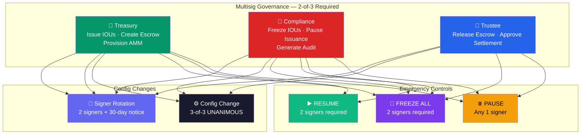

### Governance Rules Matrix

| Action | Treasury | Compliance | Trustee | Threshold |
|---|---|---|---|---|
| Issue IOUs | ✅ | — | — | 2-of-3 |
| Create Escrow | ✅ | — | — | 2-of-3 |
| Release Escrow | — | — | ✅ | 2-of-3 |
| Freeze IOUs | — | ✅ | — | 2-of-3 |
| Pause Platform | ✅ | ✅ | ✅ | 1-of-3 |
| Resume Platform | ✅ | ✅ | — | 2-of-3 |
| Config Change | ✅ | ✅ | ✅ | **3-of-3** |
| Signer Rotation | ✅ | ✅ | ✅ | 2-of-3 + 30d notice |
| Enable Trading | ✅ | ✅ | ✅ | 2-of-3 |
| Kill Switch (Trading) | ✅ | ✅ | ✅ | 1-of-3 |

---

## 🟢 Operational Flows

### Bond Lifecycle Flow

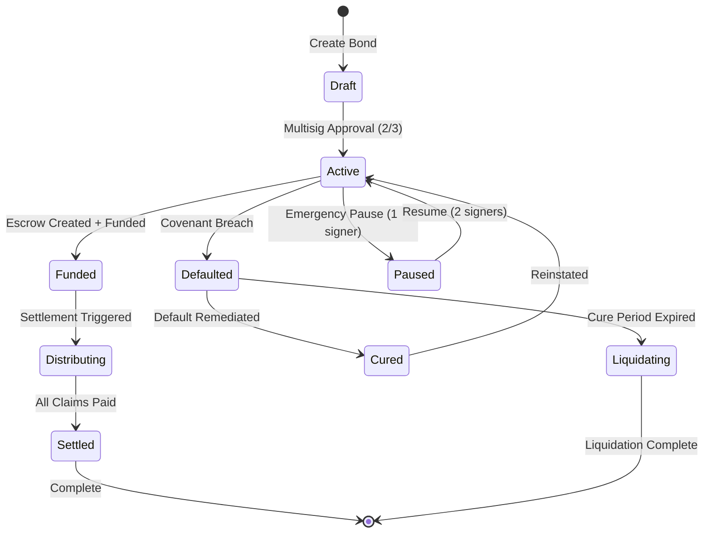

### Escrow Settlement Flow

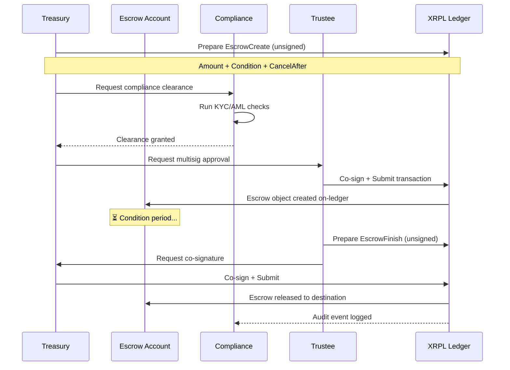

### Trading Execution Flow

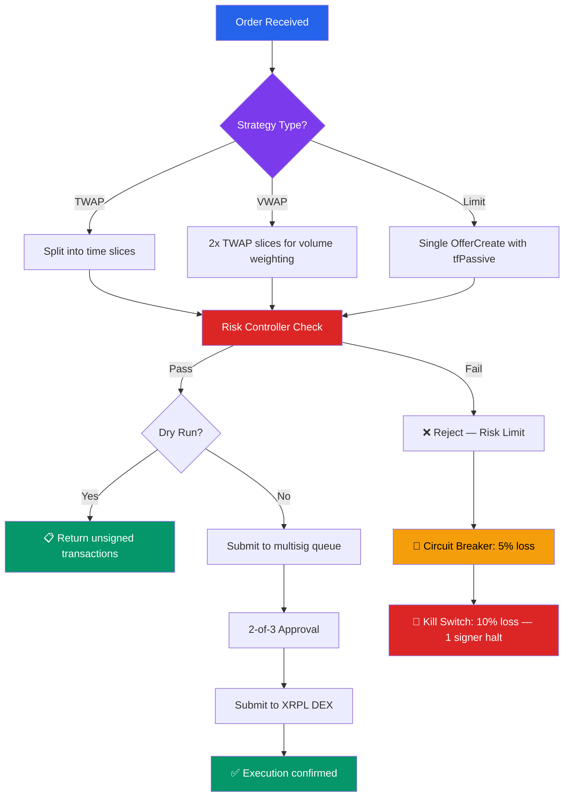

### Cross-Ledger Attestation Flow

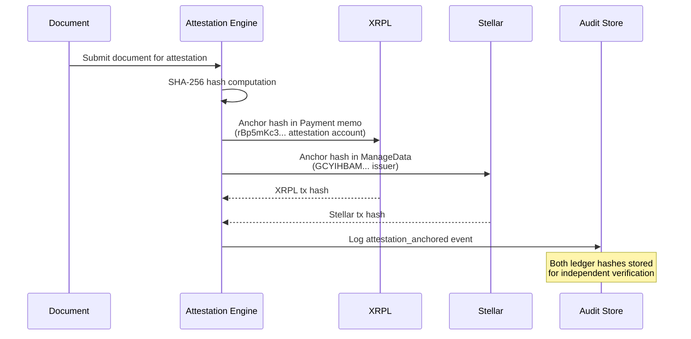

---

## 🟣 Data Flow Architecture

### Complete Transaction Pipeline

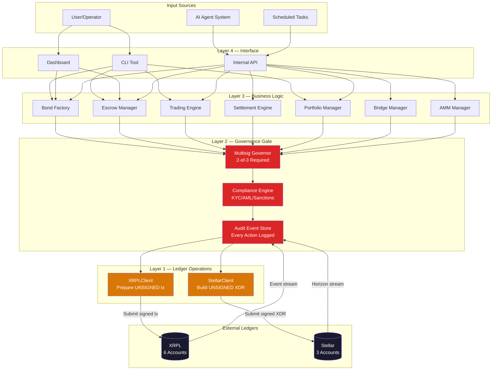

### Data Storage Architecture

```mermaid
graph TB
    subgraph "On-Ledger (Immutable)"
        XO[XRPL Objects<br/>Escrows, Trustlines, Offers<br/>Payment Memos]
        SO[Stellar Records<br/>Assets, Trustlines<br/>ManageData entries]
    end

    subgraph "Platform Storage"
        AL[Audit Event Log<br/>./logs/audit-events.jsonl<br/>Append-only, SHA-256]
        RP[Reports<br/>./reports/*.json<br/>8 report types]
        CF[Configuration<br/>config/platform-config.yaml<br/>389 lines]
    end

    subgraph "Data Room"
        DR[Institutional Data Room<br/>6 categories<br/>Document hashes attested]
    end

    subgraph "Hash Verification Chain"
        H1[Event Created] --> H2[SHA-256 Hash]
        H2 --> H3[Anchor on XRPL]
        H2 --> H4[Anchor on Stellar]
        H3 & H4 --> H5[Independently Verifiable<br/>by auditors]
    end

    style XO fill:#D97706,color:#fff
    style SO fill:#7C3AED,color:#fff
    style AL fill:#DC2626,color:#fff
    style H5 fill:#059669,color:#fff
```

---

## 🔴 Compliance & Audit

### Audit Pipeline

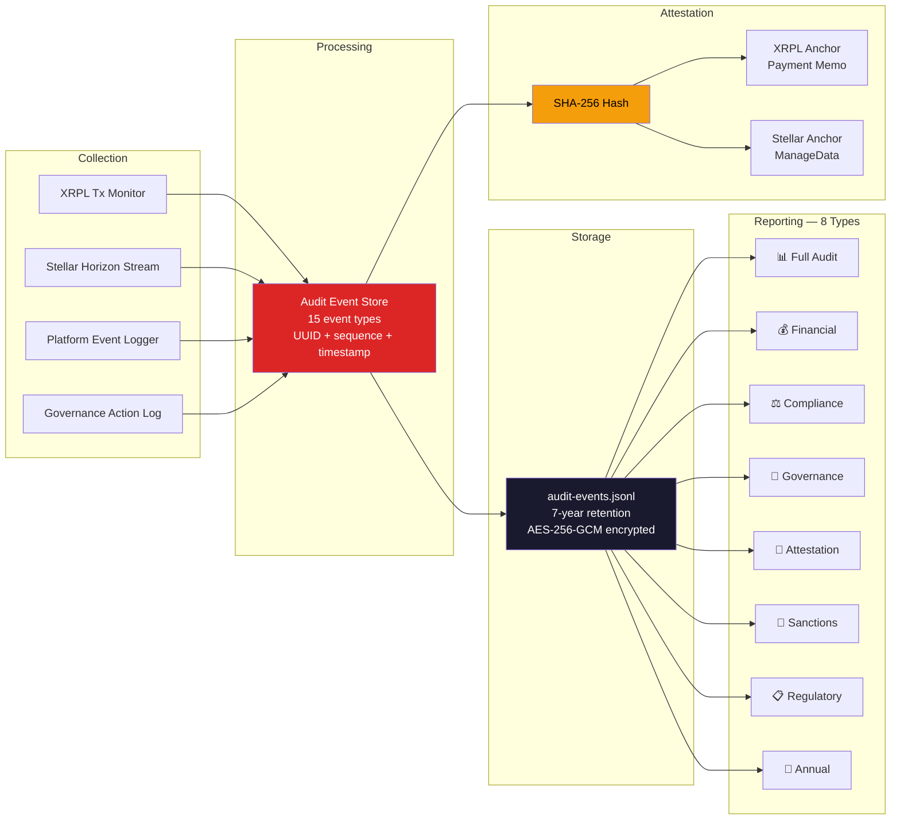

### 34 Required Audit Event Types

| Category | Events |
|---|---|
| **IOU Operations** | `iou_issued`, `iou_frozen` |
| **Escrow Operations** | `escrow_created`, `escrow_released`, `escrow_cancelled` |
| **Attestation** | `attestation_anchored`, `document_attested` |
| **AMM/DEX** | `amm_provisioned`, `amm_withdrawn`, `trade_executed`, `trade_cancelled` |
| **Governance** | `signer_added`, `signer_removed`, `config_changed`, `emergency_pause`, `emergency_resume` |
| **Bond Lifecycle** | `bond_created`, `bond_transitioned`, `bond_defaulted`, `bond_cured` |
| **Structured Finance** | `series_created`, `tranche_activated`, `waterfall_distributed`, `allocation_completed` |
| **Covenants** | `covenant_breach`, `covenant_cured` |
| **Bridge** | `bridge_configured`, `bridge_activated`, `witness_registered`, `claim_completed` |
| **AI Agents** | `strategy_approved`, `agent_executed` |
| **Reporting** | `report_generated` |

### Daily Reconciliation Checks

| Check | Tolerance | Method |
|---|---|---|
| IOU supply vs. funded amounts | **Exact match** | XRPL account_lines query |
| Escrow state vs. custodian records | ±0.01% | XRPL account_objects query |
| Stellar asset supply vs. platform records | **Exact match** | Horizon account query |
| Attestation completeness | 100% coverage | Cross-reference event log |
| Signer action log vs. ledger multisig records | **Exact match** | Compare audit log to on-chain txns |

---

## 🟠 Bridge Infrastructure

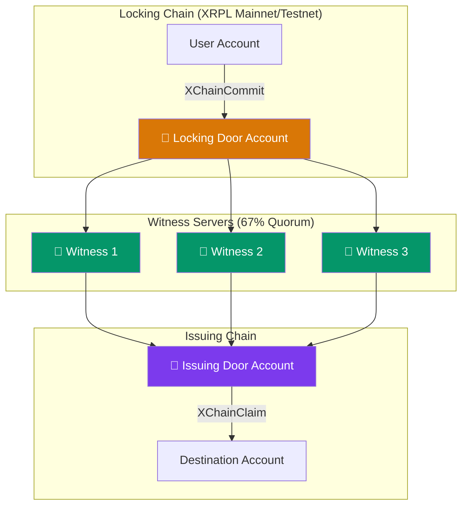

| Setting | Value |
|---|---|
| Enabled | `false` (requires multisig activation) |
| Witness minimum per chain | 1 |
| Witness quorum | 67% |
| Rotation notice | 14 days |
| Pause | 1 signer (any) |

### Bridge Transaction Types

| Transaction | Method | Description |
|---|---|---|
| `XChainCreateBridge` | `prepareXChainCreateBridge()` | Create bridge between locking and issuing chains |
| `XChainCommit` | `prepareXChainCommit()` | Lock assets on source chain |
| `XChainClaim` | `prepareXChainClaim()` | Claim assets on destination chain |

---

## 🟢 AI Execution Systems

```mermaid
graph TB
    subgraph "System 1 — Asset Intake & Verification"
        S1A[Read registries]
        S1B[Verify CUSIPs]
        S1C[Generate collateral summaries]
        S1D[❌ Cannot: Initiate transactions]
    end

    subgraph "System 2 — Credit & Structure"
        S2A[Evaluate assets]
        S2B[Generate term sheets]
        S2C[Compare structures]
        S2D[❌ Cannot: Negotiate terms]
    end

    subgraph "System 3 — Lender Interaction"
        S3A[Send templated comms]
        S3B[Analyze responses]
        S3C[Score seriousness]
        S3D[❌ Cannot: Agree to terms]
    end

    subgraph "System 4 — Governance Sentinel"
        S4A[Monitor health]
        S4B[Detect anomalies]
        S4C[Generate alerts]
        S4D[❌ Cannot: Override decisions]
    end

    HITL[👤 Human-in-the-Loop<br/>Required at EVERY critical step]

    S1C --> HITL
    S2B --> HITL
    S3B --> HITL
    S4C --> HITL

    style HITL fill:#DC2626,color:#fff,stroke:#DC2626
    style S1D fill:#fee2e2,color:#991b1b
    style S2D fill:#fee2e2,color:#991b1b
    style S3D fill:#fee2e2,color:#991b1b
    style S4D fill:#fee2e2,color:#991b1b
```

---

## 🟢 CLI & Dashboard

### Unified CLI Commands

```
$ npx ts-node apps/cli/src/cli.ts <command> [options]

Commands:
  balance          Query all account balances across XRPL and Stellar
  escrow list      List all tracked escrows
  escrow create    Prepare unsigned escrow creation transaction
  trustline verify Verify all configured trustlines on-ledger
  audit report     Generate compliance audit report
  reconcile        Run cross-ledger reconciliation
  status           Show platform infrastructure status

Global Options:
  --network <net>  Target network: testnet | mainnet (default: testnet)
  --config <path>  Path to platform-config.yaml
  --dry-run        Simulate without executing (default: true)
  --json           Output as JSON
```

### Dashboard (Port 3000)

The institutional dashboard provides **read-only** real-time visibility into:

| Card | Data Source | Content |
|---|---|---|
| XRPL Balances | Live `getAccountInfo()` × 6 | XRP balances for all accounts |
| Stellar Balances | Live `getAccountInfo()` × 3 | XLM + asset balances |
| Trustline Status | `getTrustlines()` | Active IOUs and limits |
| Escrow Status | `getEscrows()` | Active/pending escrows |
| Attestation Records | Audit event store | Hash-anchored documents |
| Bond Lifecycle | Bond factory state | Current bond status |
| Governance | Multisig governor | Signer registry + thresholds |
| Compliance | Compliance engine | KYC/AML status |
| Audit Timeline | Audit event store | Recent events |
| Reconciliation | Last reconciliation run | Match/mismatch counts |
| Platform Status | Config + connectivity | Network health |

---

## 🟣 Institutional Funding Architecture

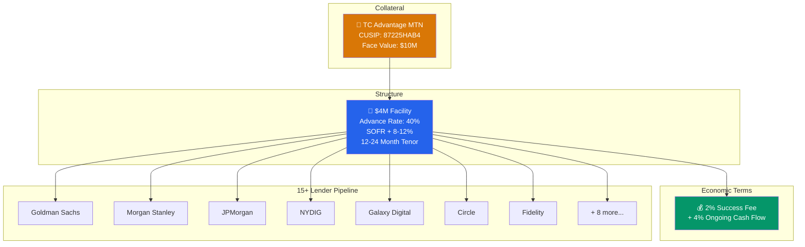

### 45-Day Execution Timeline

| Phase | Duration | Activities |
|---|---|---|
| **Phase A** | Days 1-10 | Data room population, term sheet generation, lender outreach |
| **Phase B** | Days 11-30 | Due diligence, credit committee presentations, term negotiation |
| **Phase C** | Days 31-45 | Documentation, escrow funding, settlement execution |

---

## 🔵 Test Coverage

| Suite | Tests | Phase | Focus |
|---|---|---|---|
| Phase 3 — Infrastructure | ~50 | 3 | Core packages, config validation, basic operations |
| Phase 4 — Capital Markets | ~60 | 4 | Bond factory, escrow, settlement, structured finance |
| Phase 5 — Infrastructure | ~55 | 5 | DEX, AMM, bridge, agents, gateway |
| Phase 6 — E2E | ~70 | 6 | Full pipeline testing, cross-module integration |
| Phase 7 — Connectivity | ~65 | 7 | Live XRPL/Stellar clients, dashboard, testnet verification |
| Phase 8 — Operations | ~55 | 8 | Bridge XChain, trading VWAP/limit, CLI, reconciliation |
| Package Unit Tests | ~12 | All | Individual package tests |
| **TOTAL** | **367** | — | **27 suites · 100% passing** |

---

## 🟡 Quick Start

### Prerequisites

- Node.js 18+
- npm 9+
- Git

### Installation

```bash
git clone https://github.com/unykornai/Optkas---funding-system-.git
cd Optkas---funding-system-
npm install
```

### Run Tests

```bash
npx jest                    # All 367 tests
npx jest --testPathPattern phase8   # Phase 8 only
```

### Start Dashboard

```bash
npx ts-node apps/dashboard/src/index.ts
# → http://localhost:3000
```

### Run CLI

```bash
npx ts-node apps/cli/src/cli.ts status --network testnet
npx ts-node apps/cli/src/cli.ts balance --network testnet
npx ts-node apps/cli/src/cli.ts reconcile --scope full
```

### Run Reconciliation

```bash
npx ts-node scripts/reconcile-ledgers.ts --network testnet --scope full
```

---

## 📄 Documentation Index

| Document | Description |
|---|---|
| [ARCHITECTURE.md](docs/ARCHITECTURE.md) | System architecture specification |
| [GOVERNANCE.md](docs/GOVERNANCE.md) | Multisig governance rules |
| [COMPLIANCE_CONTROLS.md](docs/COMPLIANCE_CONTROLS.md) | KYC/AML/Sanctions framework |
| [AUDIT_SPEC.md](docs/AUDIT_SPEC.md) | Audit event schema and reporting |
| [XRPL_SPEC.md](docs/XRPL_SPEC.md) | XRPL integration specification |
| [STELLAR_SPEC.md](docs/STELLAR_SPEC.md) | Stellar integration specification |
| [RISK.md](docs/RISK.md) | Risk management framework |
| [SECURITY.md](docs/SECURITY.md) | Security architecture |
| [TRUST_BOUNDARIES.md](docs/TRUST_BOUNDARIES.md) | Trust boundary definitions |
| [RUNBOOKS.md](docs/RUNBOOKS.md) | Operational runbooks |
| [BOND_FUNDING_LIFECYCLE.md](docs/BOND_FUNDING_LIFECYCLE.md) | Bond lifecycle state machine |
| [RWA_HANDLING.md](docs/RWA_HANDLING.md) | Real-world asset tokenization |

---

<div align="center">

**Built with precision by [Unykorn 7777, Inc.](https://github.com/unykornai)**


</div>
