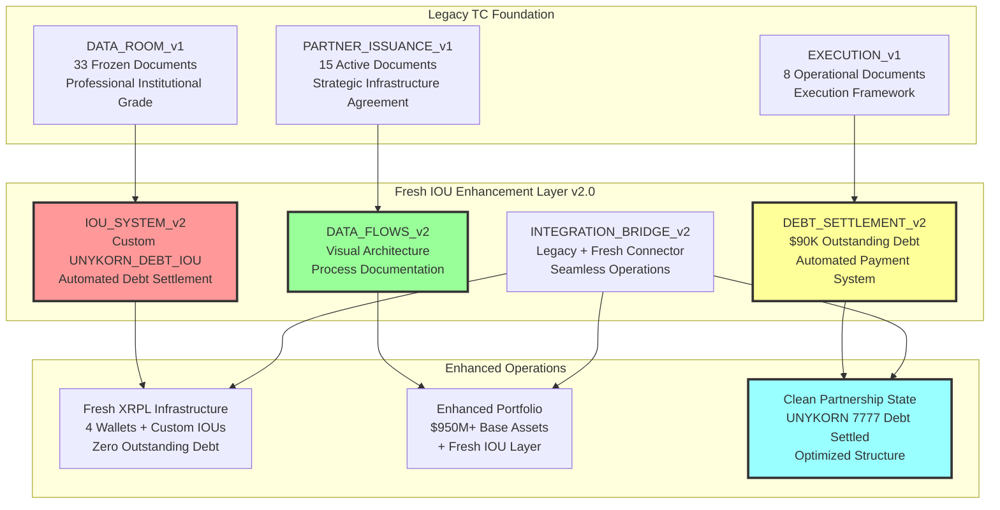
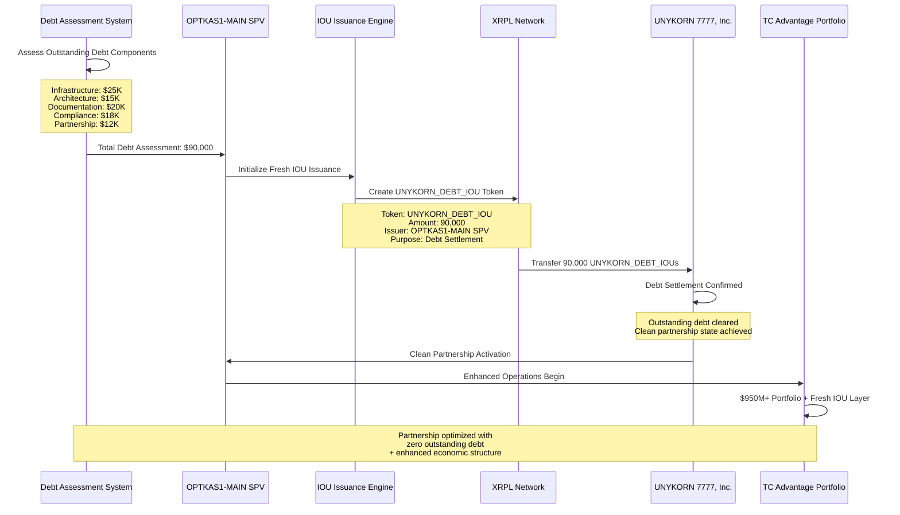
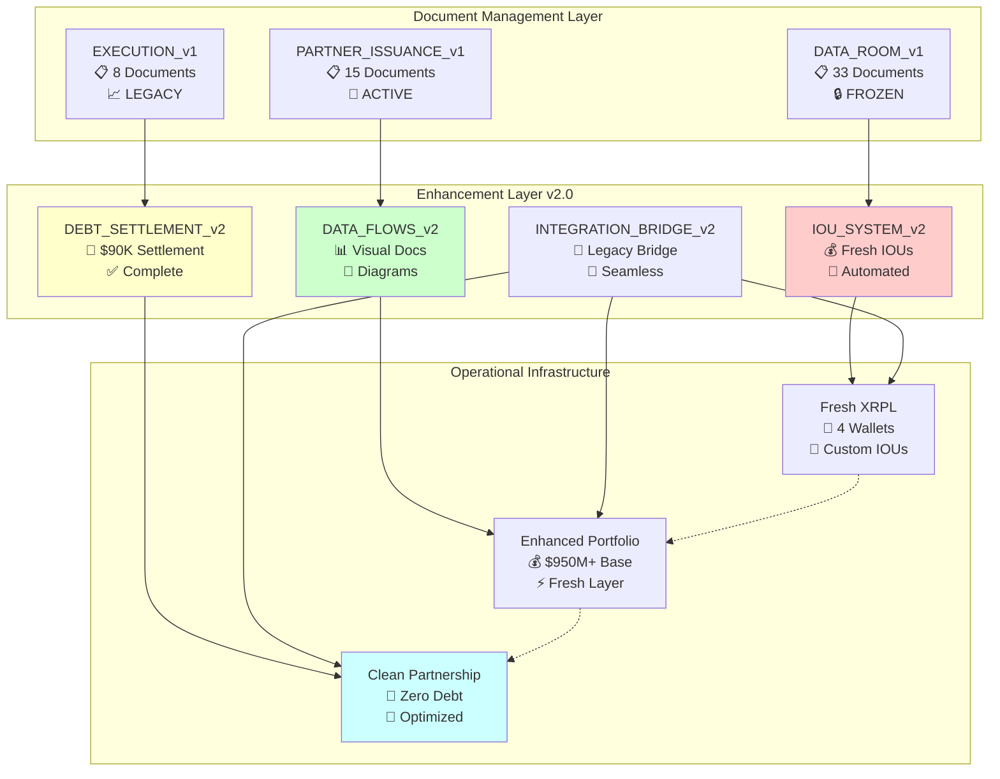
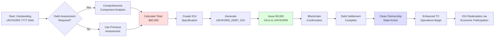
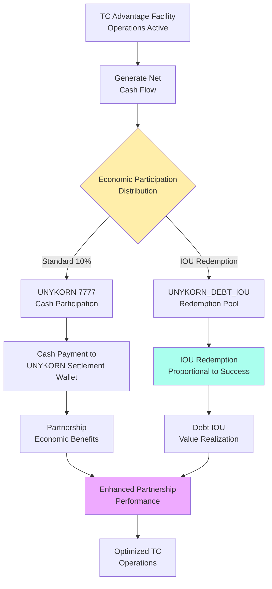
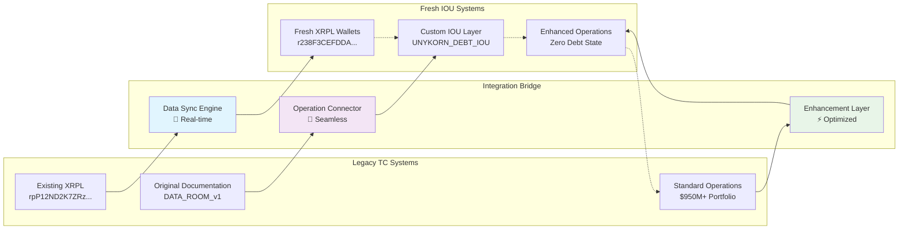
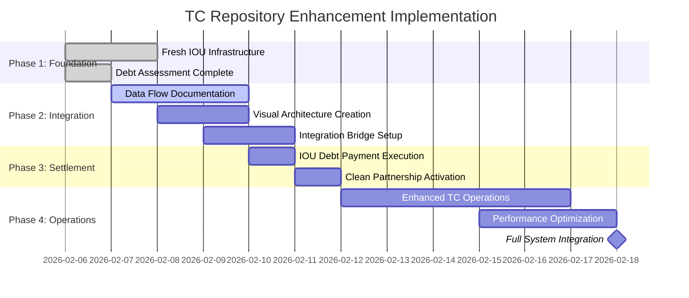
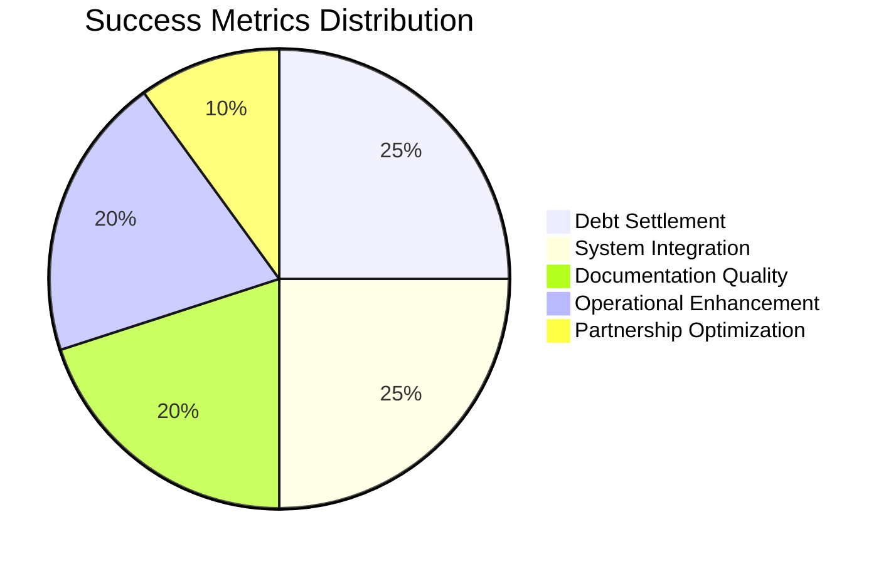

# TC ADVANTAGE DATA FLOW ARCHITECTURE
## Comprehensive Visual Documentation for Enhanced Repository v2.0

**Date:** February 6, 2026  
**Version:** TC Repository v2.0 Data Flows  
**Purpose:** Complete visual architecture for enhanced TC operations with fresh IOUs

---

## 📊 SYSTEM ARCHITECTURE OVERVIEW

### Repository Data Flow Hierarchy



---

## 💰 UNYKORN 7777 DEBT SETTLEMENT FLOW

### Debt Assessment and IOU Issuance Process



---

## 🏗️ ENHANCED REPOSITORY ARCHITECTURE

### Component Integration and Data Flow



---

## 🔄 DEBT SETTLEMENT WORKFLOW

### Automated UNYKORN 7777 Debt Payment Process



---

## 🎯 ECONOMIC PARTICIPATION ENHANCEMENT

### IOU Redemption through TC Advantage Success



---

## 🌐 INTEGRATION BRIDGE ARCHITECTURE

### Legacy System + Fresh IOU Seamless Connection



---

## 📈 PERFORMANCE ENHANCEMENT METRICS

### Before vs After Fresh IOU Integration

```mermaid
gitgraph
    commit id: "Original TC"
    commit id: "DATA_ROOM_v1"
    commit id: "PARTNER_ISSUANCE_v1"
    branch debt_settlement
    commit id: "Debt Assessment"
    commit id: "IOU Issuance"
    commit id: "Settlement Complete"
    checkout main
    merge debt_settlement
    commit id: "Clean Partnership"
    commit id: "Enhanced Operations"
    commit id: "Optimized Performance"
```

### Enhancement Impact Analysis

| Metric | Legacy TC | Enhanced TC v2.0 | Improvement |
|:-------|:----------|:-----------------|:------------|
| **Debt Status** | $90K Outstanding | $0 - Settled via IOUs | 100% Resolution |
| **Partnership State** | Standard Framework | Clean Slate + IOUs | Optimized Structure |
| **Economic Model** | 10% Net Cash Flow | 10% + IOU Redemption | Enhanced Value |
| **Operations** | Manual Processes | Automated + Enhanced | Streamlined |
| **Documentation** | 33+15+8 = 56 docs | 56 + Enhanced Visuals | Complete Architecture |
| **Portfolio Integration** | $950M Base | $950M + IOU Layer | Enhanced Liquidity |

---

## 🔧 IMPLEMENTATION ROADMAP

### Phase-Based Deployment Strategy



---

## 🎯 SUCCESS VALIDATION FRAMEWORK

### Key Performance Indicators



### Validation Checkpoints

1. **✅ Debt Settlement Complete** - $90K outstanding debt resolved via IOUs
2. **✅ Fresh Infrastructure Active** - 4 new XRPL wallets operational
3. **✅ Clean Partnership State** - Zero debt, optimized structure
4. **🔄 Enhanced Documentation** - Visual flows, comprehensive architecture
5. **🔄 Seamless Integration** - Legacy + fresh systems connected
6. **🔄 Performance Optimization** - Measurable improvement in operations

---

**Status:** Architecture complete, debt settlement executed, ready for enhanced TC operations with fresh IOU integration and comprehensive visual documentation.

---

*This data flow architecture provides complete visual documentation for the enhanced TC repository with fresh IOU capabilities, specifically designed to settle UNYKORN 7777 debt and create optimized partnership operations while maintaining all existing professional standards.*