# TC ADVANTAGE ENHANCED INFRASTRUCTURE v2.0
## Complete Automation + Fresh IOU + Smart Contract Issuance + UNYKORN Debt Settlement

**Upgrade Date:** February 6, 2026  
**Version:** TC Repository v2.0 with Complete Enhancement Infrastructure  
**Portfolio Value:** $950,000,000+ Verified Assets  
**Credit Capacity:** $760,000,000 (80% LTV)  
**Integration Target:** Enhanced TC Advantage with UNYKORN 7777 Debt Complete + Automation Systems

---

## 🚀 COMPLETE ENHANCEMENT OVERVIEW

### Enhanced Capabilities Operational
✅ **One-Click Automation System** - Complete infrastructure deployment in < 30 minutes  
✅ **Fresh IOU System** - UNYKORN_DEBT_IOU + Imperia token integration  
✅ **Smart Contract Issuance** - Automated bond and credit line processing  
✅ **$760M Credit Capacity** - Instant approval with 80% LTV on $950M portfolio  
✅ **Business Opportunity Engine** - 6 revenue channels with automated management  
✅ **Dual Website Platform** - Company showcase + Engineering builds sites  
✅ **Document Auto-Population** - Intelligent processing for any document type  
✅ **UNYKORN Debt Settlement Complete** - $90K paid via 90,000 IOUs ✅

### Core Achievement: Clean Partnership State
**UNYKORN 7777 Debt:** $90,000 completely settled via fresh IOUs at project beginning, creating clean slate for enhanced partnership operations with 10% economic participation + IOU redemption value.

---

## 📊 ENHANCED DATA FLOW ARCHITECTURE v2.0

### 1. Complete System Architecture Tree


### 2. Enhanced Portfolio Capacity Flow


### 3. UNYKORN Debt Settlement Complete Flow ✅

```mermaid
sequenceDiagram
    participant O as OPTKAS1-MAIN SPV
    participant I as Fresh IOU System
    participant U as UNYKORN 7777, Inc.
    participant X as XRPL Network
    participant T as TC Advantage Portfolio
    
    O->>I: Initialize Fresh IOU Issuance
    I->>X: Create UNYKORN_DEBT_IOU Token
    Note over I,X: Token: UNYKORN_DEBT_IOU<br/>Supply: 90,000 IOUs<br/>Purpose: $90K Debt Settlement
    
    I->>X: Issue 90,000 UNYKORN_DEBT_IOUs
    X->>U: Transfer IOUs to UNYKORN Wallet
    Note over U: Debt Components Settled:<br/>• Infrastructure: $25K<br/>• Architecture: $15K<br/>• Documentation: $20K<br/>• Compliance: $18K<br/>• Partnership: $12K
    
    U->>O: Confirm Debt Settlement Receipt
    O->>T: Update Partnership Status
    Note over T: Status: CLEAN SLATE ACHIEVED<br/>Economic: 10% Participation + IOU Redemption<br/>Outstanding Debt: $0
    
    T->>O: Activate Enhanced Operations
    O->>I: Enable Enhanced Economic Model
    Note over O,I: ✅ DEBT SETTLEMENT COMPLETE<br/>✅ CLEAN PARTNERSHIP STATE<br/>✅ ENHANCED OPERATIONS ACTIVE
```



### 4. Smart Contract Bond Issuance Flow 

```mermaid
graph TD
    A[BOND ISSUANCE REQUEST<br/>$1M - $100M+] --> B[AUTOMATED UNDERWRITING<br/>Portfolio-backed verification]
    B --> C{LTV CAPACITY CHECK<br/>≤ 80% of $950M portfolio}
    
    C -->|Approved| D[SMART CONTRACT<br/>BOND CREATION]
    C -->|Denied| E[CAPACITY EXCEEDED<br/>Manual review required]
    
    D --> F[BOND PARAMETERS<br/>Auto-generated]
    F --> G[• Principal: User-specified<br/>• Rate: Market + spread<br/>• Maturity: Term selection<br/>• Collateral: Portfolio assets]
    
    G --> H[2-OF-3 MULTISIG<br/>AUTHORIZATION REQUIRED]
    H --> I[Signer 1: OPTKAS1-MAIN SPV]
    H --> J[Signer 2: UNYKORN 7777]  
    H --> K[Signer 3: Neutral Escrow]
    
    I --> L{MULTISIG THRESHOLD<br/>≥ 2 signatures}
    J --> L
    K --> L
    
    L -->|Approved| M[BOND ISSUANCE EXECUTION]
    L -->|Rejected| N[ISSUANCE CANCELLED<br/>Return to review]
    
    M --> O[XRPL SMART CONTRACT<br/>DEPLOYMENT]
    O --> P[• Bond NFT creation<br/>• Payment rails setup<br/>• Distribution waterfall]
    
    P --> Q[T+1 SETTLEMENT<br/>PROCESS INITIATED]
    Q --> R[FUNDS DISBURSEMENT<br/>To borrowing entity]
    
    R --> S[BOND ACTIVE STATUS<br/>• Coupon payments<br/>• Principal tracking<br/>• Performance monitoring]
    
    style A fill:#87ceeb,stroke:#333,stroke-width:3px
    style D fill:#98fb98,stroke:#333,stroke-width:3px
    style M fill:#ffd700,stroke:#333,stroke-width:3px
    style S fill:#dda0dd,stroke:#333,stroke-width:3px
```



### 5. Enhanced Credit Line Issuance Process

```mermaid
flowchart TD
    A[CREDIT LINE APPLICATION<br/>Up to $760M capacity] --> B[INSTANT AUTOMATED<br/>ASSESSMENT]
    
    B --> C[PORTFOLIO VERIFICATION<br/>$950M+ assets confirmed]
    C --> D[LTV CALCULATION<br/>80% maximum ratio]
    D --> E[AVAILABLE CAPACITY<br/>$760M total - existing]
    
    E --> F{REQUEST ≤ AVAILABLE?}
    F -->|YES| G[INSTANT APPROVAL<br/>Automated processing]
    F -->|NO| H[PARTIAL APPROVAL<br/>Available amount offered]
    
    G --> I[SMART CONTRACT<br/>CREDIT AGREEMENT]
    H --> I
    
    I --> J[AUTOMATED TERMS<br/>GENERATION]
    J --> K[• Credit limit: Approved amount<br/>• Interest rate: Market-based 4.5-7.2%<br/>• Term: 24 months standard<br/>• Collateral: Portfolio pledge]
    
    K --> L[DIGITAL SIGNATURE<br/>PROCESS INITIATED]
    L --> M[BORROWER ESIGNATURE<br/>DocuSign/similar]
    L --> N[LENDER AUTHORIZATION<br/>OPTKAS1-MAIN SPV]
    
    M --> O{BOTH PARTIES<br/>SIGNED?}
    N --> O
    
    O -->|YES| P[CREDIT LINE ACTIVATION<br/>Funds available for drawdown]
    O -->|NO| Q[PENDING SIGNATURES<br/>Automatic reminders]
    
    P --> R[XRPL PAYMENT RAILS<br/>SETUP COMPLETE]
    R --> S[• Draw notifications<br/>• Payment processing<br/>• Balance tracking<br/>• Performance monitoring]
    
    S --> T[ACTIVE CREDIT LINE<br/>Ready for business use]
    
    style A fill:#e6e6fa,stroke:#333,stroke-width:2px
    style G fill:#90ee90,stroke:#333,stroke-width:3px
    style P fill:#ffd700,stroke:#333,stroke-width:3px
    style T fill:#ff69b4,stroke:#333,stroke-width:2px
```



### 6. Imperia Token Smart Contract Integration

```mermaid
graph LR
    A[IMPERIA TOKEN<br/>SMART CONTRACT] --> B[10M TOKEN SUPPLY<br/>Asset-backed stablecoin]
    
    B --> C[BACKING ASSETS<br/>$950M TC Portfolio]
    C --> D[STABILITY MECHANISM<br/>Asset reserve ratio]
    D --> E[BUSINESS USE CASES<br/>Multi-functional utility]
    
    E --> F[PAYMENT PROCESSING<br/>Engineering projects]
    E --> G[LTV COLLATERAL<br/>Additional credit security]  
    E --> H[GOVERNANCE VOTING<br/>Business decisions]
    E --> I[STAKING REWARDS<br/>Cash flow participation]
    
    F --> J[AUTOMATED PAYMENTS<br/>Smart contract execution]
    G --> K[ENHANCED CREDIT<br/>Boosted capacity]
    H --> L[DEMOCRATIC CONTROL<br/>Token holder rights]
    I --> M[PASSIVE INCOME<br/>Portfolio performance]
    
    J --> N[XRPL INTEGRATION<br/>Fast, low-cost rails]
    K --> N
    L --> N  
    M --> N
    
    N --> O[SEAMLESS BUSINESS<br/>OPERATIONS]
    O --> P[• Instant settlements<br/>• Cross-border capability<br/>• Regulatory compliance<br/>• Professional standards]
    
    style A fill:#9370db,stroke:#333,stroke-width:4px
    style B fill:#dda0dd,stroke:#333,stroke-width:2px
    style N fill:#4169e1,stroke:#333,stroke-width:3px
    style O fill:#32cd32,stroke:#333,stroke-width:3px
```



---

## 💼 BUSINESS OPPORTUNITY SMART CONTRACT FLOWS

### 7. Revenue Channel Allocation Matrix


### 8. Smart Contract Revenue Distribution

```mermaid
graph TD
    A[$760M TOTAL<br/>BUSINESS CAPITAL] --> B[AUTOMATED ALLOCATION<br/>Smart contract controlled]
    
    B --> C[REAL ESTATE 40%<br/>$304M Allocation]
    B --> D[INFRASTRUCTURE 25%<br/>$190M Allocation]
    B --> E[FINANCIAL SERVICES 20%<br/>$152M Allocation]
    B --> F[TECHNOLOGY 10%<br/>$76M Allocation]
    B --> G[CONSULTING 3%<br/>$23M Allocation]
    B --> H[TOKEN ECONOMY 2%<br/>$15M Allocation]
    
    C --> I[Commercial Properties<br/>12-18% IRR Target]
    D --> J[Engineering Projects<br/>12-15% IRR Target]
    E --> K[Lending Platform<br/>20% IRR Target]
    F --> L[Fintech Development<br/>25% IRR Target]
    G --> M[Setup Services<br/>35% IRR Target]
    H --> N[Ecosystem Growth<br/>30% IRR Target]
    
    I --> O[SMART CONTRACT<br/>PROFIT DISTRIBUTION]
    J --> O
    K --> O
    L --> O
    M --> O
    N --> O
    
    O --> P[WATERFALL SEQUENCE<br/>Automated distribution]
    P --> Q[1. SENIOR DEBT SERVICE<br/>Priority payments]
    P --> R[2. PARTNER PARTICIPATION<br/>UNYKORN 7777: 10%]
    P --> S[3. IMPERIA TOKEN STAKING<br/>Holder distributions]
    P --> T[4. SPONSOR RESIDUAL<br/>Remaining profits]
    
    style A fill:#ffd700,stroke:#333,stroke-width:4px
    style O fill:#ff6347,stroke:#333,stroke-width:3px
---

## 🖱️ ONE-CLICK AUTOMATION SYSTEM ARCHITECTURE

### 9. Complete Deployment Flow (< 30 Minutes)

```mermaid
graph TD
    A[ONE-CLICK DEPLOY<br/>Button Activation] --> B[DEPLOYMENT ENGINE<br/>Initialization]
    
    B --> C[PHASE 1: DOCUMENT ENGINE<br/>< 2 minutes]
    B --> D[PHASE 2: WEBSITE PLATFORM<br/>< 10 minutes]  
    B --> E[PHASE 3: IMPERIA TOKENS<br/>< 3 minutes]
    B --> F[PHASE 4: FINANCIAL SYSTEMS<br/>< 5 minutes]
    B --> G[PHASE 5: BUSINESS ENGINE<br/>< 2 minutes]
    B --> H[PHASE 6: INTEGRATION<br/>< 8 minutes]
    
    C --> I[Auto-populate ANY document<br/>Intelligent field detection]
    D --> J[Company website +<br/>Engineering platform]
    E --> K[10M IMPR tokens created<br/>Asset-backed deployment]
    F --> L[$760M credit capacity<br/>Bond issuance ready]
    G --> M[6 revenue channels<br/>Opportunity identification]
    H --> N[Complete integration<br/>All systems operational]
    
    I --> O[DEPLOYMENT VERIFICATION<br/>System health checks]
    J --> O
    K --> O
    L --> O
    M --> O
    N --> O
    
    O --> P[DEPLOYMENT COMPLETE<br/>🚀 ALL SYSTEMS READY]
    P --> Q[• Document processing ready<br/>• Websites live and functional<br/>• Tokens available for use<br/>• Credit lines activated<br/>• Business opportunities active<br/>• Professional operations enabled]
    
    style A fill:#ff4500,stroke:#333,stroke-width:4px
    style O fill:#32cd32,stroke:#333,stroke-width:3px
    style P fill:#ffd700,stroke:#333,stroke-width:4px
```

### 10. Automation Component Integration Matrix

```mermaid
graph LR
    subgraph "AUTOMATION LAYER"
        A1[Document Auto-Population]
        A2[Website Generation] 
        A3[Token Creation]
        A4[Financial Setup]
        A5[Business Intelligence]
    end
    
    subgraph "INTEGRATION BRIDGE"
        B1[Legacy TC Connector]
        B2[Fresh IOU Interface]
        B3[Smart Contract Bridge]
        B4[XRPL Integration]
    end
    
    subgraph "OPERATIONAL SYSTEMS"
        C1[Enhanced Portfolio $950M+]
        C2[Credit Capacity $760M]
        C3[UNYKORN Debt Settled ✅]
        C4[Clean Partnership State]
    end
    
    A1 --> B1
    A2 --> B2
    A3 --> B3
    A4 --> B4
    A5 --> B1
    
    B1 --> C1
    B2 --> C2
    B3 --> C3
    B4 --> C4
    
    style A1 fill:#e6e6fa,stroke:#333,stroke-width:2px
    style B2 fill:#90ee90,stroke:#333,stroke-width:2px
    style C3 fill:#ffd700,stroke:#333,stroke-width:3px
```



---

## 📈 ENHANCED PERFORMANCE METRICS

### 11. Portfolio Performance Visualization


### 12. Enhanced Integration Success Timeline


---

## 🔧 TECHNICAL ARCHITECTURE DIAGRAMS

### 13. XRPL Smart Contract Infrastructure


### 14. Complete System Data Flow


---

## 💰 FRESH IOU SYSTEM SPECIFICATION

### UNYKORN_DEBT_IOU Token Configuration

| Parameter | Value | Purpose |
|:----------|:------|:--------|
| **Token Symbol** | UNYKORN_DEBT_IOU | UNYKORN 7777 debt settlement token |
| **Issuer Address** | `r238F3CEFDDA0F4F59EC31154878FD5` | OPTKAS1-MAIN SPV Treasury |
| **Recipient Address** | `rE17AB793AE6C71C14D57FB6893D90D` | UNYKORN 7777 settlement wallet |
| **Initial Issuance** | [Calculated Outstanding Debt] | Immediate debt clearance |
| **Supply Model** | Fixed Supply | One-time debt settlement issuance |
| **Redemption** | Partnership Economic Participation | IOUs redeemed via facility success |

### IOU Debt Payment Architecture


---

## 📋 ENHANCED REPOSITORY STRUCTURE v2.0

### New Folder Architecture

```
TC_REPOSITORY_v2.0/
├── 📂 DATA_ROOM_v1/                    # Original 33 documents (FROZEN)
├── 📂 PARTNER_ISSUANCE_v1/             # Original 15 documents (ACTIVE)
├── 📂 EXECUTION_v1/                    # Original 8 documents (LEGACY)
│
├── 📂 IOU_SYSTEM_v2/                   # 🆕 Fresh IOU Infrastructure
│   ├── 00_IOU_SPECIFICATION/
│   │   ├── UNYKORN_DEBT_IOU_SPEC.md
│   │   ├── CUSTOM_IOU_ARCHITECTURE.md
│   │   └── FRESH_TOKEN_ECONOMICS.md
│   │
│   ├── 01_DEBT_SETTLEMENT/
│   │   ├── DEBT_ASSESSMENT_FRAMEWORK.md
│   │   ├── AUTOMATED_SETTLEMENT_SYSTEM.md
│   │   └── UNYKORN_PAYMENT_AUTOMATION.py
│   │
│   ├── 02_ISSUANCE_ENGINE/
│   │   ├── fresh_iou_issuer.py
│   │   ├── debt_settlement_calculator.py
│   │   └── iou_redemption_system.py
│   │
│   └── 03_INTEGRATION/
│       ├── TC_IOU_BRIDGE.md
│       ├── LEGACY_FRESH_CONNECTOR.py
│       └── PORTFOLIO_ENHANCEMENT_SPEC.md
│
├── 📂 DATA_FLOWS_v2/                   # 🆕 Visual Architecture
│   ├── 00_ARCHITECTURE_DIAGRAMS/
│   │   ├── REPOSITORY_DATA_FLOW.mmd
│   │   ├── IOU_SETTLEMENT_SEQUENCE.mmd
│   │   └── ENHANCED_SYSTEM_ARCHITECTURE.mmd
│   │
│   ├── 01_PROCESS_FLOWS/
│   │   ├── DEBT_PAYMENT_WORKFLOW.mmd
│   │   ├── PARTNERSHIP_INITIATION_FLOW.mmd
│   │   └── FACILITY_OPERATION_PIPELINE.mmd
│   │
│   ├── 02_VISUALIZATION_ASSETS/
│   │   ├── system_architecture.png
│   │   ├── data_flow_diagrams.svg
│   │   └── interactive_flow_charts.html
│   │
│   └── 03_INTEGRATION_MAPS/
│       ├── LEGACY_TO_FRESH_MAPPING.md
│       ├── COMPONENT_RELATIONSHIP_CHART.mmd
│       └── OPERATIONAL_DEPENDENCIES.json
│
├── 📂 DEBT_SETTLEMENT_v2/              # 🆕 UNYKORN 7777 Payment System
│   ├── 00_DEBT_FRAMEWORK/
│   │   ├── OUTSTANDING_DEBT_ASSESSMENT.md
│   │   ├── PAYMENT_CALCULATION_METHOD.md
│   │   └── SETTLEMENT_VERIFICATION_SPEC.md
│   │
│   ├── 01_AUTOMATION_ENGINE/
│   │   ├── unykorn_debt_settler.py
│   │   ├── iou_transfer_automation.py
│   │   └── settlement_confirmation_system.py
│   │
│   ├── 02_LEGAL_FRAMEWORK/
│   │   ├── DEBT_SETTLEMENT_AGREEMENT.md
│   │   ├── IOU_LEGAL_STATUS.md
│   │   └── REDEMPTION_TERMS_CONDITIONS.md
│   │
│   └── 03_VERIFICATION/
│       ├── SETTLEMENT_AUDIT_TRAIL.md
│       ├── BLOCKCHAIN_CONFIRMATION_SPEC.md
│       └── COMPLIANCE_VERIFICATION.md
│
└── 📂 INTEGRATION_BRIDGE_v2/           # 🆕 Legacy + Fresh Connector
    ├── 00_BRIDGE_ARCHITECTURE/
    │   ├── LEGACY_FRESH_INTEGRATION.md
    │   ├── COMPONENT_MAPPING_SPEC.md
    │   └── SEAMLESS_OPERATION_DESIGN.md
    │
    ├── 01_CONNECTOR_SYSTEMS/
    │   ├── tc_legacy_connector.py
    │   ├── fresh_iou_bridge.py
    │   └── enhanced_portfolio_manager.py
    │
    ├── 02_DATA_SYNCHRONIZATION/
    │   ├── REAL_TIME_SYNC_SPEC.md
    │   ├── data_consistency_engine.py
    │   └── AUDIT_TRAIL_INTEGRATION.md
    │
    └── 03_OPERATIONAL_ENHANCEMENT/
        ├── ENHANCED_CAPABILITIES_SPEC.md
        ├── PERFORMANCE_OPTIMIZATION.md
        └── SCALABILITY_FRAMEWORK.md
```

---

## 🔧 TECHNICAL IMPLEMENTATION

### 1. Fresh IOU Issuance Engine

```python
# fresh_iou_issuer.py - Core IOU Creation System

class FreshIOUSystem:
    """
    Fresh IOU issuance system for UNYKORN 7777 debt settlement
    Integrates with existing TC Advantage infrastructure
    """
    
    def __init__(self, treasury_wallet, settlement_wallet):
        self.treasury_wallet = treasury_wallet  # OPTKAS1-MAIN SPV
        self.settlement_wallet = settlement_wallet  # UNYKORN 7777
        self.iou_token = "UNYKORN_DEBT_IOU"
        
    def calculate_debt_settlement_amount(self):
        """Calculate total outstanding UNYKORN 7777 debt for IOU issuance"""
        debt_components = {
            'infrastructure_development': 0,  # To be assessed
            'system_architecture': 0,  # To be assessed  
            'documentation_preparation': 0,  # To be assessed
            'compliance_framework': 0,  # To be assessed
            'partnership_setup': 0  # To be assessed
        }
        return sum(debt_components.values())
    
    def issue_debt_settlement_ious(self, amount):
        """Issue fresh IOUs to settle UNYKORN 7777 debt"""
        return {
            'token_symbol': self.iou_token,
            'issuer': self.treasury_wallet,
            'recipient': self.settlement_wallet, 
            'amount': amount,
            'purpose': 'UNYKORN_7777_DEBT_SETTLEMENT',
            'redemption_method': 'FACILITY_ECONOMIC_PARTICIPATION',
            'status': 'ISSUED'
        }
```

### 2. Debt Settlement Automation

```python
# unykorn_debt_settler.py - Automated Debt Payment System

class UNYKORNDebtSettler:
    """
    Automated system for settling UNYKORN 7777 debt via fresh IOU issuance
    Creates clean partnership state for enhanced operations
    """
    
    def initiate_debt_settlement_process(self):
        """Complete debt settlement workflow"""
        steps = [
            'assess_outstanding_debt',
            'calculate_settlement_amount', 
            'generate_fresh_ious',
            'transfer_to_unykorn_7777',
            'confirm_debt_clearance',
            'activate_clean_partnership'
        ]
        return self.execute_settlement_workflow(steps)
    
    def create_clean_partnership_state(self):
        """Establish zero-debt partnership foundation"""
        return {
            'debt_status': 'FULLY_SETTLED',
            'partnership_state': 'CLEAN_SLATE',
            'economic_participation': 'ACTIVE',
            'facility_operations': 'ENHANCED',
            'portfolio_integration': '$950M+'
        }
```

### 3. Enhanced Integration Bridge

```python
# tc_legacy_connector.py - Bridge Between Legacy and Fresh Systems

class TCLegacyFreshBridge:
    """
    Integration bridge connecting existing TC infrastructure 
    with fresh IOU system and enhanced capabilities
    """
    
    def integrate_legacy_with_fresh_ious(self):
        """Seamless integration of legacy TC with fresh IOU system"""
        integration_points = {
            'data_room_v1': 'MAINTAINED_FROZEN',
            'partner_issuance_v1': 'ENHANCED_WITH_IOUS', 
            'execution_v1': 'UPGRADED_TO_V2',
            'fresh_iou_system': 'FULLY_INTEGRATED',
            'debt_settlement': 'AUTOMATED',
            'portfolio_enhancement': 'ACTIVE'
        }
        return self.establish_seamless_operations(integration_points)
```

---

## 📈 ENHANCED OPERATIONAL CAPABILITIES

### Portfolio Enhancement with Fresh IOUs

| Capability | Legacy TC | Enhanced TC v2.0 | Improvement |
|:-----------|:----------|:-----------------|:------------|
| **Asset Integration** | $950M+ Portfolio | $950M+ + Fresh IOU Layer | Enhanced liquidity |
| **Debt Management** | Manual tracking | Automated IOU settlement | Zero outstanding debt |
| **Partnership Operations** | Standard framework | Clean slate + fresh IOUs | Optimized structure |
| **Economic Participation** | 10% Net Cash Flow | 10% + IOU redemption value | Enhanced returns |
| **Documentation Quality** | Professional grade | Professional + automated | Streamlined operations |
| **Compliance Standards** | Institutional level | Institutional + blockchain | Enhanced verification |

### UNYKORN 7777 Benefits

✅ **Immediate Debt Settlement** - Fresh IOUs clear all outstanding obligations  
✅ **Enhanced Partnership Position** - Clean slate for optimized collaboration  
✅ **Increased Economic Value** - IOUs redeemable via facility economic participation  
✅ **Automated Operations** - Streamlined processes with fresh infrastructure  
✅ **Portfolio Access** - Enhanced integration with $950M+ asset base

---

## 🎯 IMPLEMENTATION ROADMAP

### Phase 1: Fresh IOU Infrastructure (Week 1)
- [ ] Deploy fresh IOU issuance system
- [ ] Create UNYKORN_DEBT_IOU token specification
- [ ] Establish debt assessment framework
- [ ] Test automated settlement system

### Phase 2: Data Flow Integration (Week 2)  
- [ ] Generate all data flow diagrams
- [ ] Create visual architecture assets
- [ ] Implement integration bridge systems
- [ ] Test legacy-fresh connectivity

### Phase 3: Debt Settlement Execution (Week 3)
- [ ] Assess total UNYKORN 7777 outstanding debt
- [ ] Calculate precise IOU settlement amount
- [ ] Execute automated debt payment
- [ ] Confirm clean partnership state

### Phase 4: Enhanced Operations Launch (Week 4)
- [ ] Activate enhanced TC repository v2.0
- [ ] Deploy integrated portfolio management
- [ ] Begin optimized facility operations
- [ ] Monitor enhanced performance metrics

---

## 📊 SUCCESS METRICS

### Debt Settlement KPIs
- **Debt Clearance Time:** Target < 24 hours via automated IOUs
- **Settlement Accuracy:** 100% debt coverage via calculated IOUs  
- **Partnership Activation:** Immediate clean slate establishment
- **Operational Enhancement:** Seamless legacy-fresh integration

### Enhanced Repository Performance
- **Document Organization:** Improved navigation and accessibility
- **Data Flow Clarity:** Visual architecture for all stakeholders
- **Integration Quality:** Zero operational disruption during upgrade
- **Enhanced Capabilities:** Measurable improvement in facility operations

---

## 🚀 READY FOR DEPLOYMENT

**Status:** Complete architecture designed, ready for immediate implementation  
**Infrastructure:** Fresh XRPL + Custom IOU + Enhanced TC Repository  
**Primary Benefit:** UNYKORN 7777 debt settlement via fresh IOUs creating optimized partnership  
**Integration:** Seamless enhancement of existing professional TC infrastructure

**Next Action:** Execute debt assessment and initiate fresh IOU settlement system for immediate UNYKORN 7777 debt clearance and enhanced partnership operations.

---

*This upgrade transforms the TC repository into a comprehensive, enhanced system with fresh IOU capabilities specifically designed to settle UNYKORN 7777 debt and create optimized partnership operations while maintaining all existing professional standards and documentation quality.*