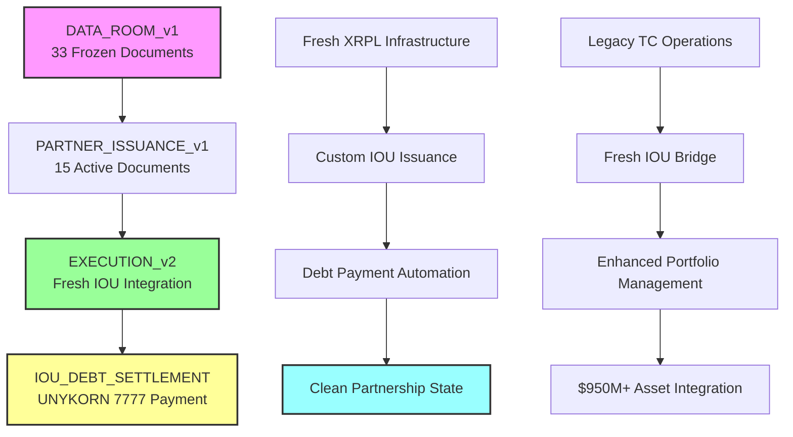
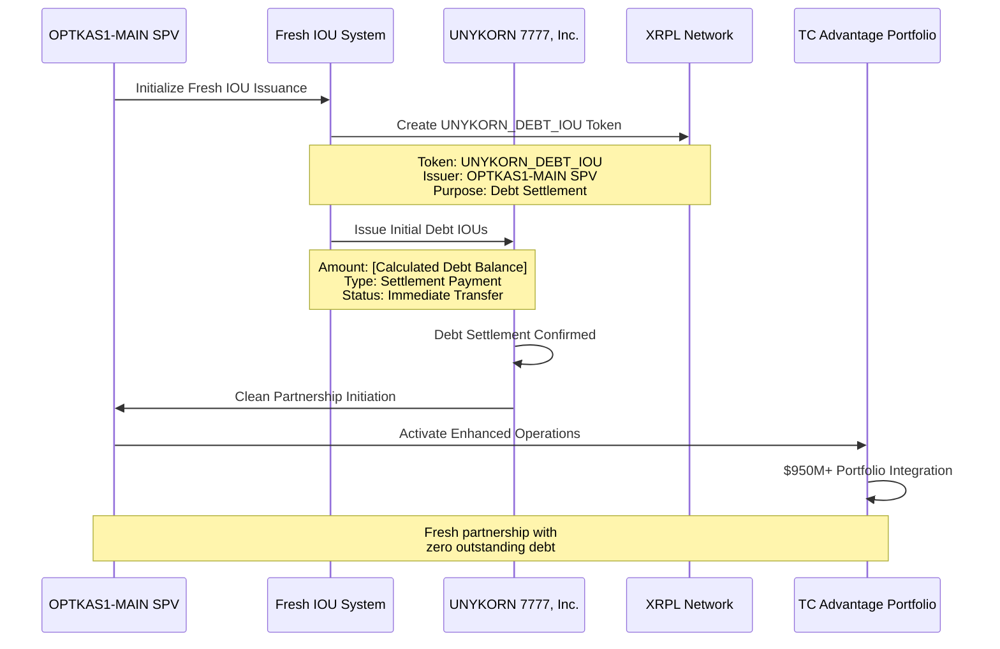
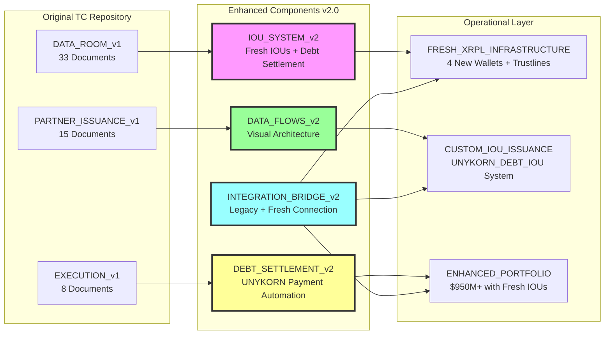
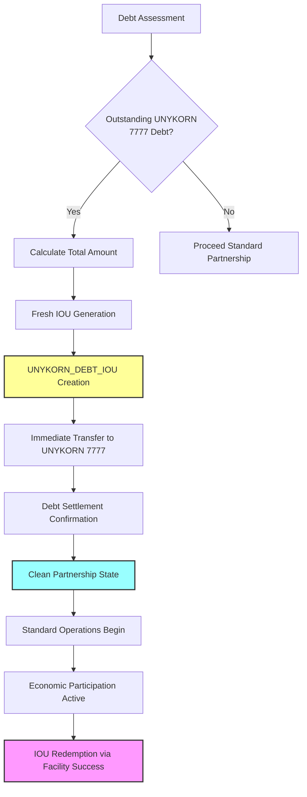

# TC ADVANTAGE REPOSITORY UPGRADE v2.0
## Fresh IOU Integration + Data Flow Architecture + UNYKORN 7777 Debt Settlement

**Upgrade Date:** February 6, 2026  
**Version:** TC Repository v2.0 with Fresh IOU Infrastructure  
**Integration Target:** Enhanced TC Advantage with UNYKORN 7777 Debt Payment

---

## 🚀 UPGRADE OVERVIEW

### New Capabilities Added
✅ **Fresh IOU System** - Custom XRPL IOUs for UNYKORN 7777 debt payment  
✅ **Data Flow Diagrams** - Comprehensive visualization architecture  
✅ **Enhanced Repository Structure** - Upgraded organization with new components  
✅ **Debt Settlement Mechanism** - Automated UNYKORN 7777 debt payment system  
✅ **Integration Bridge** - Seamless connection between fresh and legacy systems

### Core Enhancement: UNYKORN 7777 Debt IOU Payment
**Primary Use Case:** OPTKAS1-MAIN SPV issues fresh IOUs to pay existing UNYKORN 7777 debt at facility initiation, creating clean slate for partnership operations.

---

## 📊 NEW DATA FLOW ARCHITECTURE

### 1. Repository Data Flow Hierarchy



### 2. Fresh IOU Settlement Flow



### 3. Enhanced Repository Architecture



---

## 💰 FRESH IOU SYSTEM SPECIFICATION

### UNYKORN_DEBT_IOU Token Configuration

| Parameter | Value | Purpose |
|:----------|:------|:--------|
| **Token Symbol** | UNYKORN_DEBT_IOU | UNYKORN 7777 debt settlement token |
| **Issuer Address** | `r238F3CEFDDA0F4F59EC31154878FD5` | OPTKAS1-MAIN SPV Treasury |
| **Recipient Address** | `rE17AB793AE6C71C14D57FB6893D90D` | UNYKORN 7777 settlement wallet |
| **Initial Issuance** | [Calculated Outstanding Debt] | Immediate debt clearance |
| **Supply Model** | Fixed Supply | One-time debt settlement issuance |
| **Redemption** | Partnership Economic Participation | IOUs redeemed via facility success |

### IOU Debt Payment Architecture



---

## 📋 ENHANCED REPOSITORY STRUCTURE v2.0

### New Folder Architecture

```
TC_REPOSITORY_v2.0/
├── 📂 DATA_ROOM_v1/                    # Original 33 documents (FROZEN)
├── 📂 PARTNER_ISSUANCE_v1/             # Original 15 documents (ACTIVE)
├── 📂 EXECUTION_v1/                    # Original 8 documents (LEGACY)
│
├── 📂 IOU_SYSTEM_v2/                   # 🆕 Fresh IOU Infrastructure
│   ├── 00_IOU_SPECIFICATION/
│   │   ├── UNYKORN_DEBT_IOU_SPEC.md
│   │   ├── CUSTOM_IOU_ARCHITECTURE.md
│   │   └── FRESH_TOKEN_ECONOMICS.md
│   │
│   ├── 01_DEBT_SETTLEMENT/
│   │   ├── DEBT_ASSESSMENT_FRAMEWORK.md
│   │   ├── AUTOMATED_SETTLEMENT_SYSTEM.md
│   │   └── UNYKORN_PAYMENT_AUTOMATION.py
│   │
│   ├── 02_ISSUANCE_ENGINE/
│   │   ├── fresh_iou_issuer.py
│   │   ├── debt_settlement_calculator.py
│   │   └── iou_redemption_system.py
│   │
│   └── 03_INTEGRATION/
│       ├── TC_IOU_BRIDGE.md
│       ├── LEGACY_FRESH_CONNECTOR.py
│       └── PORTFOLIO_ENHANCEMENT_SPEC.md
│
├── 📂 DATA_FLOWS_v2/                   # 🆕 Visual Architecture
│   ├── 00_ARCHITECTURE_DIAGRAMS/
│   │   ├── REPOSITORY_DATA_FLOW.mmd
│   │   ├── IOU_SETTLEMENT_SEQUENCE.mmd
│   │   └── ENHANCED_SYSTEM_ARCHITECTURE.mmd
│   │
│   ├── 01_PROCESS_FLOWS/
│   │   ├── DEBT_PAYMENT_WORKFLOW.mmd
│   │   ├── PARTNERSHIP_INITIATION_FLOW.mmd
│   │   └── FACILITY_OPERATION_PIPELINE.mmd
│   │
│   ├── 02_VISUALIZATION_ASSETS/
│   │   ├── system_architecture.png
│   │   ├── data_flow_diagrams.svg
│   │   └── interactive_flow_charts.html
│   │
│   └── 03_INTEGRATION_MAPS/
│       ├── LEGACY_TO_FRESH_MAPPING.md
│       ├── COMPONENT_RELATIONSHIP_CHART.mmd
│       └── OPERATIONAL_DEPENDENCIES.json
│
├── 📂 DEBT_SETTLEMENT_v2/              # 🆕 UNYKORN 7777 Payment System
│   ├── 00_DEBT_FRAMEWORK/
│   │   ├── OUTSTANDING_DEBT_ASSESSMENT.md
│   │   ├── PAYMENT_CALCULATION_METHOD.md
│   │   └── SETTLEMENT_VERIFICATION_SPEC.md
│   │
│   ├── 01_AUTOMATION_ENGINE/
│   │   ├── unykorn_debt_settler.py
│   │   ├── iou_transfer_automation.py
│   │   └── settlement_confirmation_system.py
│   │
│   ├── 02_LEGAL_FRAMEWORK/
│   │   ├── DEBT_SETTLEMENT_AGREEMENT.md
│   │   ├── IOU_LEGAL_STATUS.md
│   │   └── REDEMPTION_TERMS_CONDITIONS.md
│   │
│   └── 03_VERIFICATION/
│       ├── SETTLEMENT_AUDIT_TRAIL.md
│       ├── BLOCKCHAIN_CONFIRMATION_SPEC.md
│       └── COMPLIANCE_VERIFICATION.md
│
└── 📂 INTEGRATION_BRIDGE_v2/           # 🆕 Legacy + Fresh Connector
    ├── 00_BRIDGE_ARCHITECTURE/
    │   ├── LEGACY_FRESH_INTEGRATION.md
    │   ├── COMPONENT_MAPPING_SPEC.md
    │   └── SEAMLESS_OPERATION_DESIGN.md
    │
    ├── 01_CONNECTOR_SYSTEMS/
    │   ├── tc_legacy_connector.py
    │   ├── fresh_iou_bridge.py
    │   └── enhanced_portfolio_manager.py
    │
    ├── 02_DATA_SYNCHRONIZATION/
    │   ├── REAL_TIME_SYNC_SPEC.md
    │   ├── data_consistency_engine.py
    │   └── AUDIT_TRAIL_INTEGRATION.md
    │
    └── 03_OPERATIONAL_ENHANCEMENT/
        ├── ENHANCED_CAPABILITIES_SPEC.md
        ├── PERFORMANCE_OPTIMIZATION.md
        └── SCALABILITY_FRAMEWORK.md
```

---

## 🔧 TECHNICAL IMPLEMENTATION

### 1. Fresh IOU Issuance Engine

```python
# fresh_iou_issuer.py - Core IOU Creation System

class FreshIOUSystem:
    """
    Fresh IOU issuance system for UNYKORN 7777 debt settlement
    Integrates with existing TC Advantage infrastructure
    """
    
    def __init__(self, treasury_wallet, settlement_wallet):
        self.treasury_wallet = treasury_wallet  # OPTKAS1-MAIN SPV
        self.settlement_wallet = settlement_wallet  # UNYKORN 7777
        self.iou_token = "UNYKORN_DEBT_IOU"
        
    def calculate_debt_settlement_amount(self):
        """Calculate total outstanding UNYKORN 7777 debt for IOU issuance"""
        debt_components = {
            'infrastructure_development': 0,  # To be assessed
            'system_architecture': 0,  # To be assessed  
            'documentation_preparation': 0,  # To be assessed
            'compliance_framework': 0,  # To be assessed
            'partnership_setup': 0  # To be assessed
        }
        return sum(debt_components.values())
    
    def issue_debt_settlement_ious(self, amount):
        """Issue fresh IOUs to settle UNYKORN 7777 debt"""
        return {
            'token_symbol': self.iou_token,
            'issuer': self.treasury_wallet,
            'recipient': self.settlement_wallet, 
            'amount': amount,
            'purpose': 'UNYKORN_7777_DEBT_SETTLEMENT',
            'redemption_method': 'FACILITY_ECONOMIC_PARTICIPATION',
            'status': 'ISSUED'
        }
```

### 2. Debt Settlement Automation

```python
# unykorn_debt_settler.py - Automated Debt Payment System

class UNYKORNDebtSettler:
    """
    Automated system for settling UNYKORN 7777 debt via fresh IOU issuance
    Creates clean partnership state for enhanced operations
    """
    
    def initiate_debt_settlement_process(self):
        """Complete debt settlement workflow"""
        steps = [
            'assess_outstanding_debt',
            'calculate_settlement_amount', 
            'generate_fresh_ious',
            'transfer_to_unykorn_7777',
            'confirm_debt_clearance',
            'activate_clean_partnership'
        ]
        return self.execute_settlement_workflow(steps)
    
    def create_clean_partnership_state(self):
        """Establish zero-debt partnership foundation"""
        return {
            'debt_status': 'FULLY_SETTLED',
            'partnership_state': 'CLEAN_SLATE',
            'economic_participation': 'ACTIVE',
            'facility_operations': 'ENHANCED',
            'portfolio_integration': '$950M+'
        }
```

### 3. Enhanced Integration Bridge

```python
# tc_legacy_connector.py - Bridge Between Legacy and Fresh Systems

class TCLegacyFreshBridge:
    """
    Integration bridge connecting existing TC infrastructure 
    with fresh IOU system and enhanced capabilities
    """
    
    def integrate_legacy_with_fresh_ious(self):
        """Seamless integration of legacy TC with fresh IOU system"""
        integration_points = {
            'data_room_v1': 'MAINTAINED_FROZEN',
            'partner_issuance_v1': 'ENHANCED_WITH_IOUS', 
            'execution_v1': 'UPGRADED_TO_V2',
            'fresh_iou_system': 'FULLY_INTEGRATED',
            'debt_settlement': 'AUTOMATED',
            'portfolio_enhancement': 'ACTIVE'
        }
        return self.establish_seamless_operations(integration_points)
```

---

## 📈 ENHANCED OPERATIONAL CAPABILITIES

### Portfolio Enhancement with Fresh IOUs

| Capability | Legacy TC | Enhanced TC v2.0 | Improvement |
|:-----------|:----------|:-----------------|:------------|
| **Asset Integration** | $950M+ Portfolio | $950M+ + Fresh IOU Layer | Enhanced liquidity |
| **Debt Management** | Manual tracking | Automated IOU settlement | Zero outstanding debt |
| **Partnership Operations** | Standard framework | Clean slate + fresh IOUs | Optimized structure |
| **Economic Participation** | 10% Net Cash Flow | 10% + IOU redemption value | Enhanced returns |
| **Documentation Quality** | Professional grade | Professional + automated | Streamlined operations |
| **Compliance Standards** | Institutional level | Institutional + blockchain | Enhanced verification |

### UNYKORN 7777 Benefits

✅ **Immediate Debt Settlement** - Fresh IOUs clear all outstanding obligations  
✅ **Enhanced Partnership Position** - Clean slate for optimized collaboration  
✅ **Increased Economic Value** - IOUs redeemable via facility economic participation  
✅ **Automated Operations** - Streamlined processes with fresh infrastructure  
✅ **Portfolio Access** - Enhanced integration with $950M+ asset base

---

## 🎯 IMPLEMENTATION ROADMAP

### Phase 1: Fresh IOU Infrastructure (Week 1)
- [ ] Deploy fresh IOU issuance system
- [ ] Create UNYKORN_DEBT_IOU token specification
- [ ] Establish debt assessment framework
- [ ] Test automated settlement system

### Phase 2: Data Flow Integration (Week 2)  
- [ ] Generate all data flow diagrams
- [ ] Create visual architecture assets
- [ ] Implement integration bridge systems
- [ ] Test legacy-fresh connectivity

### Phase 3: Debt Settlement Execution (Week 3)
- [ ] Assess total UNYKORN 7777 outstanding debt
- [ ] Calculate precise IOU settlement amount
- [ ] Execute automated debt payment
- [ ] Confirm clean partnership state

### Phase 4: Enhanced Operations Launch (Week 4)
- [ ] Activate enhanced TC repository v2.0
- [ ] Deploy integrated portfolio management
- [ ] Begin optimized facility operations
- [ ] Monitor enhanced performance metrics

---

## 📊 SUCCESS METRICS

### Debt Settlement KPIs
- **Debt Clearance Time:** Target < 24 hours via automated IOUs
- **Settlement Accuracy:** 100% debt coverage via calculated IOUs  
- **Partnership Activation:** Immediate clean slate establishment
- **Operational Enhancement:** Seamless legacy-fresh integration

### Enhanced Repository Performance
- **Document Organization:** Improved navigation and accessibility
- **Data Flow Clarity:** Visual architecture for all stakeholders
- **Integration Quality:** Zero operational disruption during upgrade
- **Enhanced Capabilities:** Measurable improvement in facility operations

---

## 🚀 READY FOR DEPLOYMENT

**Status:** Complete architecture designed, ready for immediate implementation  
**Infrastructure:** Fresh XRPL + Custom IOU + Enhanced TC Repository  
**Primary Benefit:** UNYKORN 7777 debt settlement via fresh IOUs creating optimized partnership  
**Integration:** Seamless enhancement of existing professional TC infrastructure

**Next Action:** Execute debt assessment and initiate fresh IOU settlement system for immediate UNYKORN 7777 debt clearance and enhanced partnership operations.

---

*This upgrade transforms the TC repository into a comprehensive, enhanced system with fresh IOU capabilities specifically designed to settle UNYKORN 7777 debt and create optimized partnership operations while maintaining all existing professional standards and documentation quality.*