# 🏗️ OPTKAS System Architecture

---

## Full System Architecture Diagram

```mermaid
graph TB
    subgraph "External Actors"
        OP[👤 Operator]
        AU[🔍 Auditor]
        LE[🏦 Lender]
        TR[🔑 Trustee]
    end

    subgraph "Layer 5 — Automation & AI"
        direction LR
        AGT[agents<br/>Strategy execution<br/>Dry-run mode]
        TRD[trading<br/>TWAP · VWAP · Limit<br/>Circuit breaker]
        RPT[reporting<br/>8 report types<br/>JSON + attested]
        RCN[reconcile-ledgers<br/>XRPL ↔ Stellar ↔ Platform]
    end

    subgraph "Layer 4 — Applications"
        direction LR
        DASH[dashboard<br/>Port 3000<br/>11 live cards]
        CLI[cli<br/>6 commands<br/>JSON output]
        DOCS[docs-site<br/>Static build]
        PORTAL[funding-portal<br/>Lender-facing]
    end

    subgraph "Layer 3 — Business Logic"
        direction LR
        BND[bond<br/>BondFactory<br/>Lifecycle FSM<br/>Waterfall]
        ESC[escrow<br/>EscrowManager<br/>Crypto-condition<br/>Time-based]
        ISS[issuance<br/>IssuanceEngine<br/>IOU creation<br/>Regulated assets]
        ATT[attestation<br/>AttestationEngine<br/>SHA-256 anchoring<br/>Dual-ledger]
        SET[settlement<br/>SettlementEngine<br/>Atomic cross-ledger]
        PRT[portfolio<br/>PortfolioManager<br/>NAV · P&L · IOU sync]
        RWA[rwa<br/>RWAManager<br/>Collateral mgmt]
        BRG[bridge<br/>BridgeManager<br/>XChain ops<br/>Witness config]
        DEX[dex<br/>OrderManager<br/>Pathfinding]
        AMM[dex-amm<br/>AMMManager<br/>Pool creation<br/>LP provision]
    end

    subgraph "Layer 2 — Governance & Security"
        direction LR
        GOV[governance<br/>MultisigGovernor<br/>2-of-3 threshold<br/>Emergency controls]
        COM[compliance<br/>ComplianceEngine<br/>KYC · AML · Sanctions<br/>Freeze · Clawback]
        AUD[audit<br/>AuditEventStore<br/>ReportGenerator<br/>15 event types<br/>7-year retention]
    end

    subgraph "Layer 1 — Ledger Connectivity"
        direction LR
        XC[xrpl-core<br/>XRPLClient<br/>WebSocket<br/>Account queries<br/>Tx preparation]
        SC[stellar-core<br/>StellarClient<br/>Horizon API<br/>Account queries<br/>XDR building]
        LD[ledger<br/>LedgerAbstraction<br/>Unified interface]
        GW[gateway<br/>GatewayService<br/>SEP-10 · SEP-24<br/>Fiat on/off-ramp]
    end

    subgraph "External Ledgers"
        XRPL[(XRPL<br/>6 funded accounts<br/>3 token types)]
        STLR[(Stellar<br/>3 funded accounts<br/>1 regulated asset)]
    end

    OP --> CLI & DASH
    AU --> DASH
    LE --> PORTAL
    TR --> CLI

    AGT --> TRD & PRT
    TRD --> DEX
    RPT --> AUD
    RCN --> XC & SC

    DASH --> BND & ESC & COM & AUD & XC & SC
    CLI --> BND & ESC & PRT & TRD & COM & AUD

    BND & ESC & ISS & SET --> GOV
    ATT --> XC & SC
    PRT --> XC
    BRG --> XC
    DEX & AMM --> XC
    TRD --> XC
    RWA --> ISS
    GW --> SC

    GOV --> COM
    COM --> AUD
    AUD --> XC & SC

    XC --> XRPL
    SC --> STLR

    style AGT fill:#7C3AED,color:#fff
    style TRD fill:#7C3AED,color:#fff
    style RPT fill:#7C3AED,color:#fff
    style RCN fill:#7C3AED,color:#fff
    style DASH fill:#2563EB,color:#fff
    style CLI fill:#2563EB,color:#fff
    style DOCS fill:#2563EB,color:#fff
    style PORTAL fill:#2563EB,color:#fff
    style BND fill:#059669,color:#fff
    style ESC fill:#059669,color:#fff
    style ISS fill:#059669,color:#fff
    style ATT fill:#059669,color:#fff
    style SET fill:#059669,color:#fff
    style PRT fill:#059669,color:#fff
    style RWA fill:#059669,color:#fff
    style BRG fill:#059669,color:#fff
    style DEX fill:#059669,color:#fff
    style AMM fill:#059669,color:#fff
    style GOV fill:#DC2626,color:#fff
    style COM fill:#DC2626,color:#fff
    style AUD fill:#DC2626,color:#fff
    style XC fill:#D97706,color:#fff
    style SC fill:#D97706,color:#fff
    style LD fill:#D97706,color:#fff
    style GW fill:#D97706,color:#fff
    style XRPL fill:#1a1a2e,color:#fff
    style STLR fill:#1a1a2e,color:#fff
```

---

## Package Capability Matrix

| Package | Primary Class | Methods | Layer | Dependencies |
|---|---|---|---|---|
| **xrpl-core** | `XRPLClient` | connect, disconnect, getAccountInfo, getTrustlines, getBalance, prepareTransaction, submitTransaction, getEscrows, getTransaction, getLedgerIndex | 1 | xrpl v3.1.0 |
| **stellar-core** | `StellarClient` | getAccountInfo, getBalance, buildTransaction, submitTransaction | 1 | @stellar/stellar-sdk v11.3.0 |
| **ledger** | `LedgerAbstraction` | getAccountInfo, getBalance, prepareTransaction | 1 | xrpl-core, stellar-core |
| **gateway** | `GatewayService` | authChallenge, authVerify, deposit, withdraw | 1 | stellar-core |
| **governance** | `MultisigGovernor` | registerSigner, removeSigner, submitProposal, approve, execute, pause, resume | 2 | — |
| **compliance** | `ComplianceEngine` | checkKYC, checkAML, screenSanctions, freeze, unfreeze, clawback | 2 | audit |
| **audit** | `AuditEventStore` | logEvent, getEvents, generateHash, anchorHash | 2 | xrpl-core, stellar-core |
| **bond** | `BondFactory` | createBond, transitionState, createSeries, activateTranche, distributewaterfall | 3 | governance |
| **escrow** | `EscrowManager` | prepareEscrowCreate, prepareEscrowFinish, prepareEscrowCancel, listEscrows | 3 | xrpl-core, governance |
| **issuance** | `IssuanceEngine` | issueIOU, burnIOU, createRegulatedAsset | 3 | xrpl-core, stellar-core |
| **attestation** | `AttestationEngine` | attestDocument, verifyAttestation | 3 | xrpl-core, stellar-core |
| **settlement** | `SettlementEngine` | prepareSettlement, executeSettlement | 3 | xrpl-core, stellar-core |
| **portfolio** | `PortfolioManager` | calculateNAV, calculatePnL, getExposure, syncIouBalances | 3 | xrpl-core |
| **rwa** | `RWAManager` | registerAsset, tokenize, revalue | 3 | issuance |
| **bridge** | `BridgeManager` | prepareXChainCreateBridge, prepareXChainCommit, prepareXChainClaim | 3 | xrpl-core |
| **dex** | `OrderManager` | createOffer, cancelOffer, pathfind | 3 | xrpl-core |
| **dex-amm** | `AMMManager` | createPool, addLiquidity, removeLiquidity | 3 | xrpl-core |
| **trading** | `TradingEngine` | executeOrder (TWAP/VWAP/limit), prepareCancelAll, getOpenOffers | 5 | xrpl-core, dex |
| **agents** | `AgentManager` | registerStrategy, executeStrategy, simulate | 5 | trading, portfolio |
| **reporting** | `ReportingEngine` | generateComplianceReport, generateFinancialReport + 6 more | 5 | audit |

---

## Security Boundaries

```mermaid
graph TB
    subgraph "Trust Boundary: External"
        EXT[Public Internet<br/>Lenders · Auditors · Regulators]
    end

    subgraph "Trust Boundary: Application"
        APP[Dashboard · CLI · Docs Site<br/>READ-ONLY access to state<br/>No direct ledger writes]
    end

    subgraph "Trust Boundary: Business Logic"
        BIZ[All packages prepare UNSIGNED transactions<br/>No package holds private keys<br/>Every action → audit event]
    end

    subgraph "Trust Boundary: Governance"
        GOV2[2-of-3 multisig required for ALL writes<br/>Emergency pause: 1 signer<br/>Config change: 3-of-3 unanimous]
    end

    subgraph "Trust Boundary: Ledger"
        LED[XRPL + Stellar<br/>Immutable · Public · Verifiable<br/>Hash anchoring for audit trail]
    end

    EXT -->|HTTPS only| APP
    APP -->|Internal calls| BIZ
    BIZ -->|Must pass through| GOV2
    GOV2 -->|Signed externally| LED

    style EXT fill:#6B7280,color:#fff
    style APP fill:#2563EB,color:#fff
    style BIZ fill:#059669,color:#fff
    style GOV2 fill:#DC2626,color:#fff
    style LED fill:#1a1a2e,color:#fff
```

### Core Security Invariants

| Invariant | Enforcement |
|---|---|
| **No auto-signing** | Platform NEVER holds private keys. All transactions are prepared UNSIGNED. |
| **Multisig always** | Every ledger write requires 2-of-3 signer approval. |
| **Complete audit trail** | Every action logged, hashed (SHA-256), anchored on both ledgers. |
| **7-year retention** | Audit events encrypted (AES-256-GCM), cold storage after 1 year. |
| **Dry-run by default** | Trading, agents, AMM all disabled. Must multisig-enable. |
| **Circuit breakers** | Trading halts at 5% loss. Kill switch at 10% (1 signer). |
| **Compliance gate** | Every transaction passes KYC/AML/sanctions screening before submission. |

---

## Module Interaction Heatmap

| Module | xrpl | stellar | gov | compliance | audit | bond | escrow | trading | portfolio | bridge |
|---|---|---|---|---|---|---|---|---|---|---|
| **dashboard** | ✅ | ✅ | ✅ | ✅ | ✅ | ✅ | — | — | — | — |
| **cli** | ✅ | ✅ | — | ✅ | ✅ | — | ✅ | — | — | — |
| **bond** | ✅ | — | ✅ | — | — | — | — | — | — | — |
| **escrow** | ✅ | — | ✅ | — | — | — | — | — | — | — |
| **settlement** | ✅ | ✅ | — | — | — | — | — | — | — | — |
| **trading** | ✅ | — | — | — | — | — | — | — | — | — |
| **portfolio** | ✅ | — | — | — | — | — | — | — | — | — |
| **bridge** | ✅ | — | — | — | — | — | — | — | — | — |
| **attestation** | ✅ | ✅ | — | — | — | — | — | — | — | — |
| **agents** | — | — | — | — | — | — | — | ✅ | ✅ | — |
| **reporting** | — | — | — | — | ✅ | — | — | — | — | — |
| **reconciliation** | ✅ | ✅ | — | — | — | — | — | — | — | — |
