# 🔄 OPTKAS Data Flow & Infrastructure

<div align="center">


</div>

---

## 1. Transaction Lifecycle — Complete Flow

Every transaction in the OPTKAS system follows this exact pipeline:

```mermaid
sequenceDiagram
    participant U as 👤 Operator/AI
    participant APP as 🔵 Application Layer
    participant BIZ as 🟢 Business Logic
    participant GOV as 🔴 Governance Gate
    participant COM as 🔴 Compliance
    participant AUD as 🔴 Audit Store
    participant XC as 🟠 XRPLClient
    participant SC as 🟠 StellarClient
    participant L as ⬛ Ledger

    U->>APP: Request (CLI/Dashboard/API)
    APP->>BIZ: Invoke business operation
    BIZ->>BIZ: Validate parameters
    BIZ->>GOV: Submit for multisig approval
    GOV->>GOV: Check: 2-of-3 signers?
    alt Insufficient signers
        GOV-->>BIZ: ❌ Rejected
    else Approved
        GOV->>COM: Compliance gate
        COM->>COM: KYC/AML/Sanctions check
        alt Compliance failure
            COM-->>BIZ: ❌ Blocked
            COM->>AUD: Log compliance_check_failed
        else Cleared
            COM->>AUD: Log compliance_check_passed
            AUD->>AUD: Generate SHA-256 hash
            AUD->>XC: Anchor hash (Payment memo)
            AUD->>SC: Anchor hash (ManageData)
            BIZ->>XC: Prepare UNSIGNED transaction
            Note over XC: Transaction returned to caller
            Note over U: Signers sign externally
            U->>XC: Submit signed transaction
            XC->>L: Broadcast to ledger
            L-->>AUD: Confirmation → log event
        end
    end
```



---

## 2. IOU Issuance Data Flow


### Token Flow Map

```mermaid
graph LR
    subgraph "OPTKAS.BOND Flow"
        BI[Issuer Account] -->|Issue| BT[Treasury]
        BT -->|Distribute| BH[Bond Holders]
        BH -.->|❌ Non-transferable| BH2[Cannot Transfer]
    end

    subgraph "OPTKAS.ESCROW Flow"
        EI[Issuer Account] -->|Issue| ET[Treasury]
        ET -->|Fund| EE[Escrow Account]
        EE -->|Release| ED[Destination]
    end

    subgraph "OPTKAS.ATTEST Flow"
        AI2[Attestation Account] -->|Anchor| AM[Memo on Ledger]
        AM -.->|❌ Limit: 1| AM2[Non-transferable Evidence]
    end

    subgraph "OPTKAS-USD Flow (Stellar)"
        SI[Stellar Issuer] -->|Issue| SD2[Distribution]
        SD2 -->|Settle| SA2[Anchor → Fiat]
    end

    style BI fill:#2563EB,color:#fff
    style EI fill:#059669,color:#fff
    style AI2 fill:#D97706,color:#fff
    style SI fill:#7C3AED,color:#fff
```



---

## 3. Escrow State Machine

```mermaid
stateDiagram-v2
    [*] --> Proposed: prepareEscrowCreate()
    Proposed --> Pending_Approval: Submit to governance
    Pending_Approval --> Approved: 2-of-3 multisig
    Pending_Approval --> Rejected: Insufficient signers
    Approved --> Created: Submit to XRPL
    Created --> Active: On-ledger confirmation

    Active --> Finishing: prepareEscrowFinish()<br/>Condition met
    Finishing --> Released: 2-of-3 sign + submit
    Released --> [*]: ✅ Funds delivered

    Active --> Cancelling: prepareEscrowCancel()<br/>CancelAfter expired
    Cancelling --> Cancelled: Submit to XRPL
    Cancelled --> [*]: 💰 Funds returned

    Active --> Disputed: Off-chain dispute raised
    Disputed --> Active: Dispute resolved
    Disputed --> Cancelling: Arbitration → cancel

    Rejected --> [*]
```



### Escrow Templates

| Template | Condition | Duration | Cancel After | Release Requires |
|---|---|---|---|---|
| **bond_funding** | `crypto_condition` | 90 days max | 120 days | compliance_clearance + document_verification + multisig |
| **settlement** | `time_based` | 86,400s (24h) | 30 days | multisig_approval |

---

## 4. Bond Lifecycle State Machine


### Waterfall Distribution

```mermaid
flowchart TD
    CF[💰 Cash Flow Received] --> W1[1️⃣ Trustee Fees]
    W1 --> W2[2️⃣ Senior Tranche Interest]
    W2 --> W3[3️⃣ Senior Tranche Principal]
    W3 --> W4[4️⃣ Mezzanine Interest]
    W4 --> W5[5️⃣ Mezzanine Principal]
    W5 --> W6[6️⃣ Subordinated Interest]
    W6 --> W7[7️⃣ Subordinated Principal]
    W7 --> W8[8️⃣ Equity Residual]

    style CF fill:#059669,color:#fff
    style W1 fill:#DC2626,color:#fff
    style W2 fill:#2563EB,color:#fff
    style W3 fill:#2563EB,color:#fff
    style W4 fill:#7C3AED,color:#fff
    style W5 fill:#7C3AED,color:#fff
    style W6 fill:#D97706,color:#fff
    style W7 fill:#D97706,color:#fff
    style W8 fill:#6B7280,color:#fff
```



---

## 5. Cross-Ledger Reconciliation Flow

```mermaid
flowchart TB
    START[🔄 Reconciliation Trigger<br/>CLI / Scheduled] --> CONFIG[Load platform-config.yaml]

    CONFIG --> XRPL_R[XRPL Reconciliation]
    CONFIG --> STL_R[Stellar Reconciliation]
    CONFIG --> CROSS[Cross-Ledger Comparison]

    subgraph "XRPL Checks"
        XRPL_R --> X1[Query 6 accounts<br/>getAccountInfo × 6]
        X1 --> X2[Check balances > 0]
        X2 --> X3[Verify trustlines<br/>getTrustlines × 6]
        X3 --> X4[Check DefaultRipple on issuer]
        X4 --> X5[Verify escrow integrity<br/>getEscrows]
    end

    subgraph "Stellar Checks"
        STL_R --> S1[Query 3 accounts<br/>getAccountInfo × 3]
        S1 --> S2[Check balances > 0]
        S2 --> S3[Verify issuer flags<br/>AUTH_REQUIRED<br/>AUTH_REVOCABLE<br/>CLAWBACK]
        S3 --> S4[Check multisig signers]
    end

    subgraph "Cross-Ledger Checks"
        CROSS --> C1[Compare signer counts<br/>XRPL vs Stellar]
        C1 --> C2[Verify attestation account active]
        C2 --> C3[Check governance alignment]
    end

    X5 & S4 & C3 --> REPORT[📊 Generate Report<br/>JSON + console output]
    REPORT --> SAVE[💾 Save to ./reports/]

    style START fill:#2563EB,color:#fff
    style REPORT fill:#059669,color:#fff
    style SAVE fill:#7C3AED,color:#fff
```



### Reconciliation Report Schema

```json
{
  "metadata": {
    "generated": "2026-02-07T...",
    "network": "testnet",
    "scope": "full",
    "platform": "OPTKAS",
    "version": "1.0.0"
  },
  "summary": {
    "total_checks": 25,
    "matched": 22,
    "mismatched": 1,
    "pending": 0,
    "errors": 2,
    "overall_status": "DISCREPANCIES_FOUND"
  },
  "items": [
    {
      "check": "issuer account balance",
      "ledger": "XRPL",
      "expected": ">0 XRP",
      "actual": "89.998 XRP",
      "status": "MATCH",
      "severity": "info"
    }
  ]
}
```

---

## 6. Audit Hash Anchoring Chain


---

## 7. Trading Strategy Decision Tree

```mermaid
flowchart TD
    ORD[📈 Order Input] --> TYPE{Strategy?}

    TYPE -->|TWAP| TWAP[Split into N time slices<br/>Equal size per interval]
    TYPE -->|VWAP| VWAP[2× TWAP slices<br/>Volume-weighted distribution]
    TYPE -->|Limit| LIM[Single OfferCreate<br/>tfPassive flag 0x00080000]

    TWAP --> RISK[🔴 Risk Controller]
    VWAP --> RISK
    LIM --> RISK

    RISK -->|Max position exceeded| REJECT[❌ Reject]
    RISK -->|Slippage > 2%| REJECT
    RISK -->|Daily loss limit hit| REJECT
    RISK -->|Pass| DRY{Dry Run?}

    DRY -->|Yes| UNSIGNED[📋 Return unsigned txns]
    DRY -->|No| QUEUE[Submit to multisig queue]
    QUEUE --> MSIG[2-of-3 approval]
    MSIG --> EXEC[Execute on XRPL DEX]
    EXEC --> MON[Monitor execution]
    MON --> CB{Loss > 5%?}
    CB -->|Yes| CIRCUIT[⚠️ Circuit Breaker<br/>Halt trading]
    CB -->|No| DONE[✅ Complete]
    CIRCUIT --> KS{Loss > 10%?}
    KS -->|Yes| KILL[🔴 Kill Switch<br/>1 signer halt ALL]
    KS -->|No| WAIT[Wait for manual resume]

    style ORD fill:#2563EB,color:#fff
    style RISK fill:#DC2626,color:#fff
    style CIRCUIT fill:#F59E0B,color:#000
    style KILL fill:#DC2626,color:#fff
    style DONE fill:#059669,color:#fff
```



---

## 8. Network Infrastructure Diagram

```mermaid
graph TB
    subgraph "OPTKAS Platform (Local/Cloud)"
        subgraph "Applications"
            D[Dashboard :3000]
            C[CLI]
            DS[Docs Site]
        end

        subgraph "Core Engine (20 packages)"
            P[TypeScript Monorepo<br/>npm workspaces<br/>CommonJS · ES2022]
        end

        subgraph "Storage"
            CF[config/platform-config.yaml<br/>389 lines]
            AL[logs/audit-events.jsonl<br/>Append-only]
            RP[reports/*.json<br/>8 report types]
        end
    end

    subgraph "XRPL Infrastructure"
        XT[Testnet<br/>wss://s.altnet.rippletest.net:51233]
        XM[Mainnet<br/>wss://xrplcluster.com]
        XE[Explorer<br/>testnet.xrpl.org]
        XF[Faucet<br/>faucet.altnet.rippletest.net]
    end

    subgraph "Stellar Infrastructure"
        ST[Testnet<br/>horizon-testnet.stellar.org]
        SM[Mainnet<br/>horizon.stellar.org]
        SF[Friendbot<br/>friendbot.stellar.org]
    end

    subgraph "GitHub"
        GH[unykornai/TC<br/>Private repository<br/>main branch]
    end

    P --> XT
    P --> ST
    P -.->|Production| XM
    P -.->|Production| SM
    D --> P
    C --> P

    P --> CF & AL & RP
    P --> GH

    style P fill:#059669,color:#fff
    style XT fill:#D97706,color:#fff
    style ST fill:#7C3AED,color:#fff
    style GH fill:#1a1a2e,color:#fff
    style XM fill:#6B7280,color:#fff
    style SM fill:#6B7280,color:#fff
```



---

## 9. Complete Account Interaction Map

```mermaid
graph TB
    subgraph "XRPL Account Interactions"
        ISS[🏦 Issuer] -->|Issue BOND IOU| TREAS[💰 Treasury]
        ISS -->|Issue ESCROW IOU| TREAS
        TREAS -->|Fund escrow| ESC[🔒 Escrow]
        ESC -->|Release to| TREAS
        ATT[📜 Attestation] -->|Hash memo| ATT
        AMM[💧 AMM] -->|Provision liquidity| AMM
        TRADE[📈 Trading] -->|DEX offers| TRADE
        ISS -->|Trustline from| TREAS
        ISS -->|Trustline from| ESC
        ISS -->|Trustline from| AMM
        ISS -->|Trustline from| TRADE
    end

    subgraph "Stellar Account Interactions"
        SISS[🏦 Stellar Issuer] -->|Issue OPTKAS-USD| SDIST[📤 Distribution]
        SDIST -->|Settle| SANCH[⚓ Anchor]
        SANCH -->|Fiat off-ramp| FIAT[🏦 Bank]
        SISS -->|ManageData attestation| SISS
    end

    subgraph "Cross-Ledger"
        ATT -.->|Same hash| SISS
        TREAS -.->|Reconcile| SDIST
    end

    style ISS fill:#0052CC,color:#fff
    style SISS fill:#7C3AED,color:#fff
    style ATT fill:#D97706,color:#fff
    style ESC fill:#DC2626,color:#fff
```



---

## 10. Development & Build Flow

```mermaid
flowchart LR
    subgraph "Development"
        CODE[TypeScript Source<br/>20 packages + 3 apps]
        TEST[Jest Tests<br/>27 suites · 367 tests]
        LINT[ts-jest transpilation]
    end

    subgraph "Build"
        TSC[tsc · ES2022 target<br/>CommonJS output]
        JEST[Jest with ts-jest<br/>30s timeout · forceExit]
    end

    subgraph "Deployment"
        GIT[Git push → GitHub<br/>unykornai/TC]
        DASH2[Dashboard<br/>npx ts-node apps/dashboard]
        CLI2[CLI<br/>npx ts-node apps/cli]
    end

    CODE --> TSC
    CODE --> TEST
    TEST --> JEST
    JEST -->|367 pass| GIT
    TSC --> DASH2 & CLI2

    style CODE fill:#2563EB,color:#fff
    style JEST fill:#059669,color:#fff
    style GIT fill:#1a1a2e,color:#fff
```


